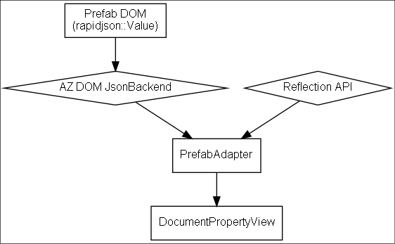
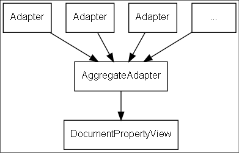

# O3DE Document Property Editor

### Summary:
Currently, O3DE handles Editor property editing with its Reflected Property Editor, a Qt-widgets based property grid that can edit types exposed by O3DE's reflection system. This proposal outlines a new, more generic property editor that can be used to modify arbitrary types by way of providing an extensible `PropertyEditorDocument` model that allows arbitrary consumers to create a robust, extensible property grid editor.

### Terms:
- DOM: Document Object Model, a tree structure consisting of elements, each of which may have their own attribute metadata (in the form of a series of key/value pairs) and sets of child elements.
- RPE: Reflected Property Editor, the current property Editor in O3DE that works with its reflection system via the `SerializeContext` and `EditContext` classes.
- `InstanceDataHierarchy`: The existing O3DE adapter class used by the RPE to generate an internal model from the reflection system.

### What is the relevance of this feature?
The existing Reflected Property Editor has a few limitations that have come up in production:
- It's tightly coupled with the O3DE reflection system by design (by way of `InstanceDataHierarchy`, a graph builder based on the reflection serialize and edit contexts) which makes it a bespoke property editor for the reflection system only. Specifically, this has created significant friction when integrating with the Prefab system. Functionality like "pinning" arbitrary properties in a Prefab is problematic as the existing reflection system was not designed to easily construct synthetic types at runtime.
- Consumers of the ReflectedPropertyEditor API have to take special care when communicating changes back to the property editor. A notable source of Editor performance regressions have stemmed from requests to refresh the entire property tree, which leads to a complete recreation of all widgets in the property grid. This can be mitigated by taking care to only partially refresh the RPE in some circumstances, but this adds an extra layer of complexity for consumers, who are often not UI subject matter experts, to get property refreshes correct.
- The Qt Widget layer of its user interface has some longstanding performance concerns with large data sets, as each row entry for its property grid is instantiated as a Qt Widget (a `PropertyRowWidget`) at all times. This can lead to performance issues for large property trees.

With this in mind, the new Document Property Editor will be built with the following principles in mind:
- **Decouple from the reflection system.** It shall be built from the ground up with the idea of consuming properties produced from multiple sources, not just the O3DE Reflection system. Consumers writing their own document adapter layers can change the layout of their desired property grid and its attributes arbitrarily at runtime. This will allow properties to be added on top of the reflection system, like pinned properties for prefabs, as well as integration with systems orthogonal to the reflection system, including possibly authoring classes for the reflection system itself.

- **Build with performance and scale in mind.** 
The Document Property Editor's UI shall only update as much as needed to reflect changes to its graph. A delta between the current state and the previous state will be handled by comparing the underlying property documents in a format similar to a JSON patch, and only those patches will be applied to the UI. This means that the equivalent of an "entire tree" refresh can be requested with a significantly lower performance penalty.

    The Qt Widget layer of the Document Property Editor shall use a windowing system to only create the physical widget representations needed for property editors currently visible on-screen, constraining the QWidget construction and memory overhead to what's needed to render on screen at a given time.

- **Reuse as much as possible.** While the property editor itself needs to better handle performance and extensibility, we already have a rich property editing user experience with a wide array of widgets for handling different properties. These attributes should continue to be respected in the new system, and existing property editors should continue to work with little to no change to allow the property to avoid unnecessary work and regression of user experience. This may require a small adapter layer between the new Editor and legacy handler widgets.

    This is a backend change to how the property editor shall be rendered and updated; the initial user experience offered by the Document Property Editor should be identical to the Reflected Property Editor, while paving the way for important expansions and features like prefab pinning.

- **Promote extensibility.** Where possible, we shall provide hooks in the new property editor to allow extending and customizing behavior, such as label display and context menu integration to allow consumers to add any needed behaviors without baking them into the property editor itself.

### Feature design description:
The Document Property Editor's implementation shall be split between its model, a `DocumentAdapter`, the view, a `DocumentPropertyView` populated by `PropertyRowWidget` instances containing `PropertyHandlerInstance` instances.

#### DocumentAdapter

An adapter object that, given a target object for the Document Property Editor to edit, will produce a document object model representation that the `DocumentPropertyView` can understand. This model is purely for modeling and testing property editing behavior, and has no UI functionality itself.

When the `DocumentPropertyView` wishes to update a value (generally via a `Handler`) it shall notify the `DocumentAdapter` via a signal that contains a DOM path and a DOM value.

The adapter shall be responsible for updating this DOM representation any time values within it change and providing the new model or a set of patches to the `DocumentPropertyView` so that it may update its state. The adapter shall be responsible for deciding when to send these updates; the intention is for DOM comparison and editor updates to be efficient enough that, if desired, an adapter could generate its entire DOM every tick and submit the differences (if any) to the property editor.

Adapters shall be composable, such that a high level adapter could use another adapter to populate and update its subelements, if desired. An adapter for data exposed via O3DE's reflection system shall be provided and is expected to be the "basic" adapter that is used and proxied by most other adapters. Adapters may even be provided by reflected classes themselves, to customize their exact behavior and appearance on-screen.

The `PrefabAdapter`, which shall be used for editing prefabs on components in the stead of the current Reflected Property Editor, shall take the existing prefab DOM and transform it into a format the `DocumentPropertyView` can understand, using the Generic DOM API to visit the prefab data and O3DE's reflection API to enumerate and inject editing metadata to the resulting DOM.



This underlying DOM will provide the functionality to compare with another document and produce a set of patches to produce the new model from the old one. This can be done with a simple hierarchical comparison, and will allow the `DocumentPropertyView` to only update entries that change, even when doing a total refresh.

This will depend on a Generic DOM that provides the core DOM manipulation API and allows the data from the new reflection system to be efficiently transformed into the a document format `DocumentPropertyView` can understand.

When doing multi-edit, the `DocumentPropertyView` shall store multiple DOMs and use an `AggregateAdapter` to proxy all the instances and produce a DOM with a shared set of editable attributes based on any common shared elements. Property changes will be communicated to all DOMs by the aggregate adapter.



Individual property handlers will be responsible for deciding how to deal with aggregate instances, assuming each instance has the same handler they'll be notified of the number of aggregate instances and their various values. The UX may be later adapted for some general handling for this case, e.g. displaying a "Values Differ" label with an option to reset the value for each selected instance.

#### DocumentPropertyView & PropertyRowWidget

The `DocumentPropertyView` is a Qt Widget that handles visualizing and interacting with a `DocumentAdapter`. The editor shall consist of a virtual scroll area with a set of `PropertyRowWidget` entries for each visible entry based on the current hierarchy.

`PropertyRowWidget` shall take an element from the `DocumentAdapter` and consist of indentation, an optional expand/collapse arrow, an optional label, and one or more Handler widgets for the current property or UI element. All elements may be configured by attributes of the row's element. Handlers shall be provided by the `DocumentPropertyView` and not owned by the row widget, as the Editor may provide pooling behavior for performance purposes. Rows themselves may be destroyed or recycled by the `DocumentPropertyView` based on the scroll state. Notably, `PropertyRowWidget` will exist as Qt widgets instead of merely being painted by the `DocumentPropertyView` to provide easier parity with the existing `ReflectedPropertyEditor`, which relies on Qt stlye sheet support.

`PropertyRowWidget` itself will have very little logic; `DocumentPropertyView` shall handle the population of each row's internal widgets based on the DOM structure of the row as provided by a document provider.

#### PropertyHandler & PropertyHandlerWidget

PropertyHandlers are registered singletons that provide an API for constructing widgets to visualize or edit properties of a given type. They provide an API for reading a value from the DOM into the UI and notifying the `DocumentAdapter` that a value should be updated.

An adapter shall be provided to map property handlers from the RPE to these PropertyHandlers - the RPE handler API may be adjusted slightly in the process to remove any dependency on `InstanceDataHierarchy`.

Property handlers of a given type will by default be assumed to have a fixed height, to prevent the `DocumentPropertyView` from needing to instantiate every handler for every row in order to correctly generate scroll area information without instantiating heavy widgets. In the case that a property handler's per-row height may vary, it will be incumbent on the handler to implement a method to calculate its height, but for the common case of fixed row sizes shall only ever require one PropertyHandler widget instance to be created for each handler type to do size calculation.

The MultiLine text handler from the RPE is an example of this - its height is proportionate to the number of lines of text within it, so the MultiLine handler would have to use font metrics to calculate its height for a given row and cache that for the current set of known values.

Proposed usage example, for a property editor for a reflected object that's edited in-place:
```cpp
ReflectedStruct someInstance;

// ...

ReflectedPropertyAdapter adapter;
adapter.SetRootObject(&someInstance);

DocumentPropertyView* editor = new DocumentPropertyView;
editor->SetDocumentProvider(&document);

editor->show();
```

For prefabs, a specific `PrefabAdapter` shall be provided that works with the Prefab DOM.
```cpp
// This will be whatever the in-memory representation the prefab store is using
rapidjson::Value prefabRoot;
// This might be a rapidjson::Pointer or an AZ::DOM::Pointer, probably the former initially
// A dom path within the hierarchy specified by prefabRoot
Pointer domPath;

PrefabAdapter adapter;
adapter.SetPrefabRoot(prefabRoot);
adapter.SetRootPath(domPath);

DocumentPropertyView* editor = new DocumentPropertyView;
editor->SetDocumentProvider(&adapter);

editor->show();
```

### Technical design description:
Internally, the `DocumentPropertyView` expects a DOM structure consisting of a node-based hierarchy comprised of:
- `Row` elements, that may contain any number of widget elements within. Nested rows will be displayed as children within the hierarchy, while all other nodes will be turned into widget representations and laid out  horizontally within the row. A row shall be rendered as a `PropertyRowWidget` on-screen.

    Attributes on a `Row` shall be consumed by the `DocumentPropertyView` itself to provide row-specific functionality, such as `AutoExpand` to indicate whether the row should be expanded in the UI by default.
- `Label` elements are textual labels displayed within a `Row`. Labels shall correspond to `QLabel` instances within a `PropertyRowWidget`.
- Widget elements are a catch-all for all property handlers that have been registered to the `DocumentPropertyView`. Widget elements shall have a tag name corresponding to either the name of a registered handler or the `Widget` name, which shall infer the handler type based on either its `Handler` parameter or the default handler registered for its associated `Value`. Widgets shall correspond to their resolve handlers. Adapters may provide custom widgets directly by way or providing a `Widget` element with a `Handler` attribute corresponding to an `AZStd::function<PropertyHandlerWidget*()>` factory function without having to register a generic handler for their type.

    Values may be stored as an attribute or series of child `Value` nodes. Multiple `Value` entries will be interpreted as intent to perform an aggregate edit on multiple instances of a given property. Other arbitrary attributes may be stored on a given widget node and processed by its UI handler.

This structure, if vizualized, would resemble the following. Please note that this is structured as pseudo-XML for illustrative purposes, the DOM representation of the Document Property Editor is not intended to be serialized (except potentially as a debugging mechanism):
```xml
<Row>
    <Label>Root</Label>
    <Row>
        <Label>Numeric Slider w/ Range</Label>
        <NumericSlider Value="10" Min="0" Max="20" Step="1" />
    </Row>
    <Row>
        <Label>Vector3</Label>
        <Vector3>
            <Value x="0" y="1" z="0" />
        </Vector3>
    </Row>
    <Row>
        <Label>Read-only Attribute</Label>
        <DefaultEditor Value="10" ReadOnly="true" />
    </Row>
    <Row>
        <Label>Custom Widget</Label>
        <Widget Handler="<in-memory handler factory function>" />
    </Row>
    <Row>
        <Button Label="Full-row Push Button" />
    </Row>
    <Row>
        <Label>2x2 Property Table</Label>
        <Row>
            <Label>Col 1</Label>
            <DefaultEditor Value="0">
            <Label>Col 2</Label>
            <DefaultEditor Value="1">
        </Row>
        <Row>
            <Label>Col 1</Label>
            <DefaultEditor Value="2">
            <Label>Col 2</Label>
            <DefaultEditor Value="3">
        </Row>
    </Row>
</Row>
```
Helper methods shall be provided for tasks in constructing and reading from a Document Property Editor DOM, such as creating a `Label` node with a text argument.

The adapter interface shall be responsible for translating data from another source, such as the Prefab DOM or a binary object, into the Document Property Editor DOM. Changes to this DOM are communicated to and from the `DocumentPropertyView` by way of Generic DOM patches.

```cpp
//! A DocumentAdapter provides an interface for transforming data from an arbitrary
//! source into a DOM hierarchy that can be viewed and edited by a DocumentPropertyView.
class DocumentAdapterInterface
{
public:
    virtual ~DocumentAdapterInterface() = default;

    //! Retrieves the entire contents of this DocumentAdapter and sends it to the
    //! specified VisitorInterface.
    virtual void Visit(AZ::DOM::VisitorInterface* visitor) const = 0;

    //! Helper method. Gets the contents of this adapter as a DOM value.
    //! Calls Visit internally.
    virtual AZ::DOM::Value GetDocumentContents() const;

    //! Notifies when a document has been replaced with a new value.
    //! A call to Visit will be needed to retrieve the up-to-date state.
    void ConnectDocumentResetHandler(AZ::Event<>::Handler& handler);

    //! Notifies when the adapted document has changed.
    //! The patches, applied to the previous state, shall produce an equivalent
    //! document to what a call to Visit would create.
    void ConnectDocumentChangedHandler(AZ::Event<const AZ::DOM::Patch&>::Handler& handler);

    //! Requests a change to the underlying data adapted by this adapter in the form
    //! of a DOM patch and returns true if the application was successful.
    //! This is used by the view to apply all state changes. If the patch affects the document
    //! this adapter represents, a notification should be triggered by ApplyPatchToView to
    //! notify the view of the change's effect.
    virtual bool ApplyPatchToBackingStore(const AZ::DOM::Patch& patch) = 0;

protected:
    //! Notifies the view that the document has completely changed, and the view
    //! shall need to query Visit again to receive an updated document.
    void ResetDocument();
    //! Notifies the view that a change has occurred in the document.
    //! The patches, applied to the previous state, should produce an equivalent
    //! document to what a call to Visit would create.
    void ApplyPatchToView(const AZ::DOM::Patch& patch);
};
```

A `DomValueAdapter` shall be used to author a DOM in-memory and send that to the `DocumentPropertyView`. 
```cpp
//! A document adapter that represents an in-memory AZ::DOM:Value.
class DomValueAdapter : public DocumentAdapterInterface
{
    //! Sets the DOM Value this adapter represents.
    void SetValue(const AZ::DOM::Value& value);

    //! Gets the DOM Value this adapter represents.
    const AZ::DOM::Value& GetValue() const;

    //! Applies a patch to the DOM Value this adapter represents.
    void ApplyPatchToValue(const AZ::DOM::Patch& patch);

    // DocumentAdapterInterface ...
    void Visit(AZ::DOM::VisitorInterface* visitor) override;
    // By default, this just calls ApplyPatchToValue.
    // Override to handle updating the underlying value this adapter represents.
    bool ApplyPatchToBackingStore(const AZ::DOM::Patch& patch) override;
};
```

The intermediate DOM values bound to a callback in lieu of attributes to handle cases in which attributes need to refresh themselves based on the current DOM state.
```cpp
struct BoundValue
{
    //! A set of DOM paths that, if changed, will cause this value to be re-evaluated
    AZStd::vector<AZ::DOM::Pointer> m_sourcePaths;
    //! A function that returns the current value, based on the root value specified.
    //! This shall be re-evaluated when values at this value's source paths, relative
    //! to the document root, change.
    AZStd::function<AZ::DOM::Value(const AZ::DOM::Value&)> m_valueFn;
};
```
A `BoundValue` shall be translated by a `DocumentPropertyView` into a value type in the visualized DOM and updated when a source path changes.

Property handler widgets shall be registered to a set of type IDs and communicate via DOM values. An adaptor layer will be provided for the existing Reflected Property Editor handlers.

```cpp
class PropertyHandlerWidgetInterface : public QWidget
{
public:
    using DomValueList = AZStd::vector<const AZ::DOM::Value&>;

    //! Helper method, attempts to extract an attribute of type T from a given DOM widget.
    //! Returns false if unable to convert the type, or if the fetched values differ.
    template <class T>
    bool GetAttributeFromNode(const DomValueList& widgetNodes, AZ::Name attribute, T& value);

    //! Helper method, attempts to extract a value of type T from a given DOM widget.
    //! Returns false if unable to convert the type, or if the fetched values differ.
    template <class T>
    bool GetValueFromNode(const DomValueList& widgetNodes, T& value);

    //! Sets the current values to edit, with each entry of widgetNode
    //! representing one value being edited, in a multi-edit scenario.
    virtual void SetValuesFromDom(const DomValueList& widgetNodes) = 0;

signals:
    //! Notification for when this widget would like to change the value for all edited instances.
    void ValueChangedByUser(size_t index, const AZ::DOM::Value& newValue);

    //! Notification for when this widget would like to change the value for a given edited instance.
    void ValuesChangedByUser(const DomValueList& newValues);
};
```

The `DocumentPropertyView` shall be a `QAbstractScrollArea` that turns a `DocumentAdapterInterface`'s DOM representation into a visualized widget.

```cpp
class DocumentPropertyView : public QAbstractScrollArea
{
public:
    //! Sets the adapter interface responsible for populating this View's DOM.
    void SetDocumentProvider(AZStd::shared_ptr<DocumentAdapterInterface> provider);

    void ExpandAll();
    void CollapseAll();
    void ExpandTo(AZ::DOM::Pointer path);
}
```

Internally, the `DocumentPropertyView` shall calculate the geometry of the visual elements in its DOM and internally pool widgets to ensure that physical `PropertyRowWidget`s are only created and persisted for the currently visible region of the view. As an implementation detail, it may be advantageous for `DocumentPropertyView` to have an internal `ViewAdapter` that stores stateful view information in the DOM.

### What are the advantages of the feature?
- The  will streamline key workflows such as Prefab pinning, in which attributes from the prefab hierarchy are "pinned" to a prefab instance, by allowing adapters to dynamically create their own DOM structure
- There are opportunities for significant performance improvements
- The property editor may be extended and used for other purposes, like editing the Settings Registry

### What are the disadvantages of the feature?
- The up-front implementation complexity and surface area for functionality regressions is high, as this rewrites a considerable portion of the Reflected Property Editor

### How will this be implemented or integrated into the O3DE environment?
The Document Property Editor can be implemented in phases, here's a tentative plan of attack:

1. Prerequisite: get the Generic DOM and an algorithm for generating patches by using a patch generation algorithm to compare between two DOMs in place (this can be a simple recursive comparison, no isomorphic comparison should be necessary for the property editor case). Patch generation will need to be tuned for performance. Minimal patches are not required, but care will need to be taken to ensure unnecessary extra steps in patch application are minimized.
1. Build and test a simple `DocumentAdapter` (`RawJsonDocumentAdapter`) for editing primitive types in a form layout.
1. Build the initial `DocumentPropertyView` and get it working with our simple `DocumentAdapter`. (4 engineer-weeks, 1 engineer)
1. Begin filling in feature gaps to meet parity with the RPE such as multi-edit and adapters for all existing UI handlers.
1. Begin work on a `ReflectionDocumentAdapter` - this adapter should have a heavy emphasis placed on unit testing, with as much business logic as possible moved into the non-UI Adapter layer.
1. After `ReflectionDocumentAdapter` is ready, components can start using the `DocumentPropertyView` for editing in the entity inspector.
1. Implement pinning any and any other new features for Prefabs, using reflection and any new attributes needed to dictate behavior. We can consider creating a `PrefabPropertyEditor` if we find we need to add a lot of prefab-specific logic to keep things clean.

As future work, we can look at integrating with other systems such as the settings registry or authoring schemas for reflected classes.

### Are there any alternatives to this feature?
- An attempt has been made to bolt prefab pinning onto the existing Reflected Property Editor. While possible with the existing Reflcted Property Editor using a dynamic instance data hierarchy, the implementation complexity is high, as is the surface area for bugs.

### How will users learn this feature?
- This feature should not have a direct user experience impact. UX-facing features, such as prefab pinning, have been extensively iterated upon and are outside the scope of this RFC.

### Are there any open questions?
- Is there an alternative to using the Generic DOM?

    While it would be preferable to leverage the Generic DOM, as it allows us to avoid reinventing the wheel for a bespoke solution and should make interoperation with the reflection system faster, we can build a bespoke solution with a library like rapidjson that supports fast element comparison and generate JSON patches. Alternate approaches would need to be considered for cases like storing widget handlers as `AZStd::function`s in DOM nodes using the Generic DOM's `AZStd::any` functionality.