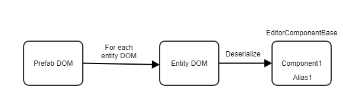
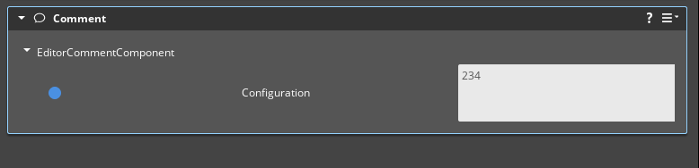
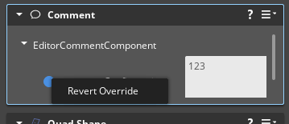
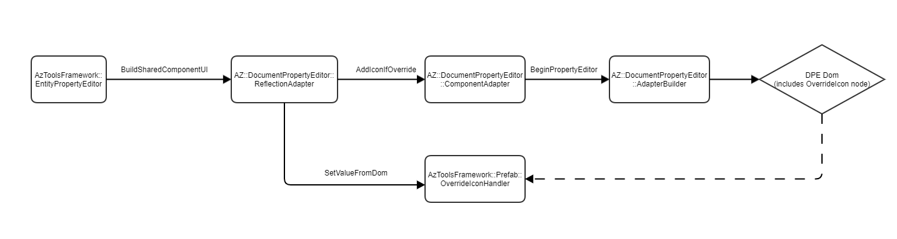
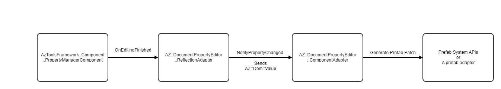

Summary
=======

Ref: https://github.com/o3de/sig-content/issues/112 

Through the implementation of [https://github.com/o3de/sig-content/issues/75](https://github.com/o3de/sig-content/issues/75) , support now exists in the editor behind a feature flag to author and manage prefab overrides. A brief tutorial explaining the current state of overrides behind the flag can be found [here](https://development--o3deorg.netlify.app/docs/learning-guide/tutorials/entities-and-prefabs/override-a-prefab/). In the current state, users can only see and revert overrides on entities rather than individual components and properties. Since an entity can have many components under it, it is very likely that users would only want to revert specific overrides on an entity rather than all of them at once. This is what other major game engines offer too. There have been attempts made in the past to add prefab override support to the current RPE based Entity Inspector. However, since prefabs work with DOM data and the RPE uses data generated using object pointers, the integration proved to be very difficult and complicated. With the introduction of DPE, which uses DOM data too, the systems are better placed to handle the integration now. At the time of writing this document, the work to make the CVar editor and AssetEditor use DPE is in its final stages. There has been some work also done to use make the entity inspector use DPE as the framework. This design proposes building on top of that work to add override viewing and managing support to the DPE based entity inspector. So, there is a hard dependency on the Entity Inspector to use DPE instead of RPE as its property editors in order to launch the features mentioned in this document.

At a high level, these are the changes that this design proposes:

*   Addition of the component alias (the string that identifies the component in a prefab JSON DOM) to the AzToolsFramework::Components::EditorComponentBase class, which will be used during prefab patch generation to target the exact component alias in the prefab DOM that changed
*   Registration of an OverrideIconHandler to the AzToolsFramework:PropertyEditorToolsSystem, which will be used to show icons and custom menu options next to overridden properties
*   Storing opaque types as serialized values in AZ:Dom instead of pointers to the opaque values themselves. This will make patch generation easier and will also unblock other features like multi-editing in the Entity Inspector
*   Sending the patches generated using the above ways to the prefab system APIs so that they can be stored in memory appropriately as either as direct prefab edits or as overrides on prefabs.

What is the relevance of this feature?
======================================

Why is this important?
----------------------

This work is important because right now, users don't have visual indications in the Entity Inspector to see whether a property is overridden or not. They can only know that something is overridden by switching between the component editors of the default component and the overridden component. Even if they can find what's overridden in this manner, they cannot revert an individual property override on a component. Then can only revert all the overrides on an entity through the outliner, which is not the desired workflow always.

What are the use cases?
-----------------------

1.  As an editor user, I need to know which particular components and properties are overridden on an entity
2.  As an editor user, I need to be able to revert overrides on components and properties on an entity
3.  As a prefab system owner, I need to be able to ingest patches generated by DPE rather than calculate them again

What will it do once completed?
-------------------------------

Once completed, this work will

*   Accomplish the above mentioned use cases and make the prefab system feature complete. This is pretty much the final work needed to bring the prefab system to feature parity to slices and other industry standard prefab systems.
*   This will also make it easier to implement features like multi-editing in the entity inspector
*   This will make it easier to implement features like pinning and using AZ:Dom as the in-memory data format for prefabs.

Glossary:
=========

*   **DOM** : Document Object Model is a representation of an object data in a tree format where each node represents a certain part of the document.
*   **DPE (Document Property Editor)** : A new property editor system in development for O3DE that uses a DOM data model. See rfc [here](https://github.com/o3de/sig-content/blob/main/rfcs/rfc-11-document-property-editor.md).
*   **RPE (Reflected Property Editor)** : The current property editor system for O3DE which uses pointers to objects as the data model.

Feature and Technical Design Description
========================================

There are multiple pieces that need to be finished in order to achieve prefab override management through the Entity Inspector. The major ones will be discussed here:

Injecting serialized component alias string into AzToolsFramework::Components::EditorComponentBase objects
----------------------------------------------------------------------------------------------------------

Entities in a prefab instance object are stored in an unordered map of entity alias(string) to entity objects . Given an entity alias string in a DOM, it's easy to map to the actual entity object in a prefab. Just like entity aliases, the JSON serializer also creates component aliases (strings) for each component. The system-generated component aliases look like 'Component\_\[17501195180351523199\]' but can be changed at any time by the user. Unlike the entity aliases, given a component alias string in a DOM, there is no way to identify which component object it maps to. This mapping will be crucial in order to apply patches to an individual component within a prefab DOM. To bridge this gap, this design proposes injecting the serialized component alias string into the AzToolsFramework::Components::EditorComponentBase class, which is the base class for all editor components in O3DE. This injection will happen in the JsonEntitySerializer class that loads entities from DOM values. During the time of prefab patch generation we will be extracting the alias from the component and use it to construct a DOM path to be placed in the patch. Eg: .../PathToEntity/Components/**SerializedComponentAliasString**/AnyPropertyPath . The reason for injecting this alias into EditorComponentBase class instead of AZ::Component class is because prefab patch calculation only needs to happen at editor time and doesn't have any value at runtime and we can avoid allocating 1 string's worth of memory per component at runtime.

  
This does increase the editor memory usage but it is not a significant number for even a large level (a few MB). For a level with10k entities with 10 components each, the total number of editor components would be 100k. So the increase in editor memory usage would be 100k \* size of AZStd::string. Based on whether a stateless allocator is used or not, the size for a string varies from 24-32 Bytes. So, we would be looking at a 2-3 MB increase in editor memory usage. 



### API changes

**EditorComponentBase class additions**

```
class AzToolsFramework::Components::EditorComponentBase // This is an existing class
{
public:
    .... // Existing functions and members
	void SetAlias(const AZStd::string& alias);
	AZStd::string GetAlias();
private:
    AZStd::string m_alias;
}
```

Identifying and reverting overridden properties/components
----------------------------------------------------------

The key to indicating which properties are overridden is to create a custom handler for the override visualization. The MVP use case for override visualization is that an override icon will be added next to properties that are overridden. In order to support that, the proposal is to create a new 'OverrideIcon' node and register it with the PropertyEditorSystemInterface so that it is recognized as a valid node type in the DPE DOM. The node should also be accompanied with a handler class that inherits from the AzToolsFramework::PropertyHandlerWidget class. This handler class will be responsible for showing the override icon when an 'OverrideIcon' node is encountered in the DPE Dom.

Here is a rough image of what the override icon would look like next to overridden properties. In the image below, the EditorCommentComponent's 'configuration' field is modified and stored as an overrride, hence the blue icon (Ignore the weird spacing. It's a Qt setting that needs to be fixed in the prototype)



Once we have the OverrideIconHandler, adding a revert option is going to be easy because the handler inherits from the PropertyHandlerWidget, which at the end of the day is a QWidget. So, the widget's behavior will be extended to show a custom context menu using Qt 'customContextMenuRequested' signal. When the 'revert' option is clicked from the custom context menu, the call needs to be sent to AzToolsFramework:Prefab:PrefabOverridePublicInterface so that the prefab system can revert the override on the specified property of the component within the selected entity.

Here is a rough image of how that override menu option would look like (taken from the prototype):



The exact behavior of where and when the override icon will appear for different types of property hierarchies is subject to a UX review. You can find some of these different hierarchies in the 'Open Questions' section and the proposed places of where the override icons should show up. The rule of thumb for where the icon should show up that will be followed for initial development is 'Show it next to the row it appears in the entity inspector. If that is not possible, show it next to the 'group' it belongs to if any. If neither of them is possible, show it next to the component'. These type of UX decisions will be however discussed with sig-ux to reach a consensus on what's the best user experience for the editor user.



### API Changes/Additions

**PropertyEditorNodes class**
```
namespace AZ::DocumentPropertyEditor::Nodes // Existing namespace
{
	.
	.
	. // Existing node types
    struct OverrideIcon : PropertyEditorDefinition
    {
        static constexpr AZStd::string_view Name = "OverrideIcon";
    };
}
```
  

**OverrideIconHandler class**
```
// New class
class AzToolsFramework::OverrideIconHandler
    : public PropertyHandlerWidget<QToolButton>
{
public:
	// Connect the customContextMenuRequested signal to the showContextMenu here.
    OverrideIconHandler();

	// This will be the function responsible for adding the actual icon in the inspector. Input is the OverrideIcon node in the DPE DOM
    void SetValueFromDom(const AZ::Dom::Value& node);

    static constexpr const AZStd::string_view GetHandlerName()
    {
        return AZ::DocumentPropertyEditor::Nodes::OverrideIcon::Name;
    }

    void showContextMenu(const QPoint&);
}; 
```

**DPEComponentAdapter class additions**
```
AZ::DocumentPropertyEditor::ComponentAdapter //Existing class
{
public:
    // Checks whether an override exists on the prefab at the provided serializedPath and if it does, adds an OverrideIcon node into the DPE DOM
    // Adds the entity and component aliases to the serializedPath so that the path to the component/property from the prefab correctly constructed.
    void AddIconIfPropertyOverride(AdapterBuilder* adapterBuilder, const AZStd::string_view& serializedPath);
protected:
    AZStd::string m_entityAlias;
    AZStd::string m_componentAlias;
    AZ::EntityId m_entityId;
}
```

Generating prefab patches from DPE patches instead of serializing entities to generate patches
--------------------------------------------------------------------------------------------------------

There are multiple ways to generate a valid prefab patch, one of them being serializing the entities to JSON and comparing that JSON to the data stored in the in-memory prefab templates. This is what is currently being done in the editor to calculate prefab patches when a component property changes. However, DPE has its own patch generation mechanism that generates AZ:Dom:Patch based on the AZ:Dom data stored in DPE DOM. Since DPE generates patches at a more local level (individual component), the prefab system needn't serialize the entire entity just to know which components are modified. That information can be fetched from the DPE and a valid Prefab patch can be calculated from it.

The responsibility of creating the prefab patches and calling appropriate prefab APIs to accept those patches can all be delegated to a prefab adapter that listens to events from the ComponentAdapter.

Generate Prefab Patches



### API Changes

In order for the ComponentAdapter to be able to listen to property edits in the editor, the design proposes to add a handler to the ReflectionAdapter:PropertyChangeEvent as a class member and connect it to the event. When the event gets triggered, the ComponentAdapter class will generate a valid prefab patch. The generation of the prefab patch is a responsibility that can be delegated to a prefab adapter in the future.

**DPEComponentAdapter additions for prefab patch generation**
```
AZ::DocumentPropertyEditor::ComponentAdapter //Existing class
{

protected:
	// This is the function that'll generate a valid prefab patch when a property is edited.
    void GeneratePropertyEditPatch(const ReflectionAdapter::PropertyChangeInfo& propertyChangeInfo);
	
	// This is the handler that'll listen to property change events and call the above function to generate a valid prefab patch.
	// This handler will be connected to listen to the events during the class construction
	ReflectionAdapter::PropertyChangeEvent::Handler m_propertyChangeHandler;
}
```

In order for the prefab system to easily ingest the AZ:Dom:Value the DPE produces, [opaque types](https://github.com/o3de/o3de/blob/development/Code/Framework/AzCore/AzCore/DOM/DomValue.h#L42) supported by AZ:Dom:Value add a slight wrinkle. An opaque type in AZ:Dom:Value is basically a shared pointer to an AZStd::any. It is used to store values in AZ:Dom:Value that can't be mapped to primitive types likes ints and strings(eg. AZ::Vector3). The data stored in those opaque values is not in the desired format for the prefab system as it expects a patch in jsonPatch format. So, the opaque values need to be serialized to produce JSON so that it can be put in a jsonPatch. This serialization to JSON will be done in the ReflectionAdapter while generating AZ:Dom from the instance pointers if a 'SerializedPath' attribute (AZ::Reflection::DescriptorAttributes::SerializedPath) can be found in the reflected data. If a serialized path attribute is not found (eg. ui related properties that doesn't affect prefab data), we will continue to store them as opaque types. Since the modification of such properties won't affect the prefab data in any manner, those opaque types will not cause an issue with prefab patch generation. By doing this, not only will we be making the process of generating prefab patches easier but we will also unblock other features like multi-editing in the DPE, where the changes to opaque values won't always be detected (see [https://github.com/o3de/o3de/pull/12130#discussion\_r977081325](https://github.com/o3de/o3de/pull/12130#discussion_r977081325)).

Are there any alternatives to this feature?
===========================================

Alternative 1 : Keep calculating patches on the entire entity for a single property edit
----------------------------------------------------------------------------------------

The challenging part of the design mentioned in this document would be to make the DPE send the correct patches/overrides to the prefab system. This alternative solution sidesteps the problem by making the prefab system calculate its own patches and ignoring the DPE patches, which is what is currently being done in the editor.

Behind the feature flag, modifying a component property correctly generates a prefab override in development right now. The way this works is because the undo system marks entities as dirty and uses that to correctly generate the prefab patches by serializing the entire entity. It's not efficient but it does the job of generating prefab patches and propagating them. With this alternate solution, the dpe backed inspector will only be used for reading and deleting overrides whereas the create and update will be handled by prefabs system itself.

### Pros: 

*   Least amount of work to enable visualization and reverting of overrides in the editor

### Cons:

*   By sidestepping the DPE and not taking advantage of the patches it generates, we will be delaying/blocking future action items like using AZ:Dom as the in-memory dom format for prefabs too
*   Multi-editing feature in the entity inspector would need to know when the opaque types change. But right now since the opaque types are not serialized and we only store a hash to the pointer of the opaque value, multi editing won't work fully when DPE encounters opaque types. If we go with this alternate solution, multi-editing won't work fully and need to implement a custom solution to serialize opaque values as needed.

### Why the proposed solution is preferred to this alternative?

The proposed solution is preferred because this alternative only achieves partial integration of prefabs with the DPE architecture. In order to take full advantage of the DPE's AZ:Dom and AZ:Dom:Patch formats and use them to replace rapidjson and jsonPatch in prefabs, it is better to spend time now to achieve a better integration now so that they are well placed for these future efforts.

Alternative 2 : Keep storing opaque types in the DPE DOM and only serialize them during the construction of prefab patch
------------------------------------------------------------------------------------------------------------------------

One way to avoid serializing the entire entity just for a property change is to inspect the az:dom:patch that the DPE already produces and use that to generate a prefab json patch. This is what is proposed in the document above. But an alternative approach to this would be to serialize opaque values on an as-needed basis. During the inspection of DPE patches, if we encounter opaque values, we can then serialize them to generate valid json patches.

### Pros:

*   No changes to Adapter/Dom/DPE architecture on how opaque types are handled. So it'll be less amount of work than the proposed solution.

### Cons:

*   For every property edit of an opaque value, we need to serialize it, which is much more resource intensive than the proposed solution which only serializes it once
*   Faces the same problem with multi-editing like the above alternate solution

### Why the proposed solution is preferred to this alternative?

The same reason as not choosing the above alternative. In addition to that, this solution would also require a lot of redundant and repeated serializations of the same property for every single property edit. While we may find a caching solution to prevent that from happening, the complexity and maintenance requirements of such a cached solution can be avoided if we go with a better integration which is also simpler to maintain and expand over time.

What are the advantages of the feature?
=======================================

*   Editor users will be able to see and revert individual property overrides on a prefab
*   Editor users will be able to see and revert component addition and removal overrides on a prefab
*   Prefab system can avoid calculation of patches on the entire entity by ingesting patches generated by the DPE for a single property edit.

What are the disadvantages of the feature?
==========================================

*   None

What are the risks associated with this feature?
================================================

*   This feature has a hard dependency on the Entity Inspector to use DPE instead of RPE as its property editors in order to launch the features mentioned in this document.  
    *   Mitigation strategy:  Work with the folks working on DPE and get an MVP list of features required to enable DPE in the entity inspector
*   The sheer number of different component types to support is very large. This is a risk for using DPE for entity inspector as well. Not only do we need to make sure that all existing components work fine in the entity inspector using DPE but also need to ensure that all of those
    *   Mitigation strategy: A lot of user testing needs to be done. We can reach out to individual teams within O3DE,  ask them what are the common type of components they mostly interact with and work with them to create custom test strategies. This approach worked in the past when we migrated all the slices in AutomatedTesting project to use prefabs instead.

How will this be implemented or integrated into the O3DE environment?
=====================================================================

**MVP:**

The work listed below is sufficient to be able to perform CRUD operations on overrides through the entity inspector. For the creation/updating part, we will be sidestepping the DPE and doing it ourselves. This is what is currently being done in development branch as well. This is the easier part of the design and relatively straightforward.

1.  Show override icons in the entity inspector next to overridden properties
    1.  Requires creating an OverrideIconHandler and registering it with PropertyEditorToolsSystem
2.  Provide option to revert a particular override
    1.  Requires adding context menu to the icon created above
    2.  Requires the context menu click to be integrated with the Revert methods in PrefabOverridePublicInterface

**Next phase:**

Once the MVP has been delivered, we can optimize the systems further and tackle the complex integration parts.

1.  Generate prefab patches from DPE patches instead of making the prefab system calculate the patches itself by serializing and comparing the entire entity.
    1.  Serialize opaque types to JSON and store the values in AZ:Dom of DPE.
    2.  Once AZ:Dom:Patches are generated, convert them into jsonPatch patches for the prefab system
    3.  Use the above mechanism instead of current prefab patch calculation mechanism for property edits.
    4.  Get rid of opaque and pointer types in AZ:Dom types altogether if possible.

How will users learn this feature?
==================================

*   The tutorials section about prefabs in the O3DE website([https://www.o3de.org/docs/learning-guide/tutorials/entities-and-prefabs/entity-and-prefab-basics/](https://www.o3de.org/docs/learning-guide/tutorials/entities-and-prefabs/entity-and-prefab-basics/)) will be updated with screenshots and videos on how to work with overrides in the entity inspector.
*   There will also be developer centric documentation([https://github.com/o3de/o3de/wiki/Prefab-Developer-Documentation](https://github.com/o3de/o3de/wiki/Prefab-Developer-Documentation)) that'll be added to the website explaining the architecture of override management in the Entity Inspector.
*   Additional presentations and recordings will be made either in next year's O3DCon or directly to the O3DE YouTube channel

Are there any open questions?
=============================

*   What's the feature flag that I need to enable to see the current state of overrides in development?
    *   Under PATH\_TO\_PROJECT/user/Registry/editorpreferences.setreg , add this:

**EnableOverridesUx**

```
{
    "Amazon": {
        "Preferences": {
            "EnablePrefabSystem": true
        }
    },
    "O3DE": {
        "Preferences": {
            "Prefabs": {
                "EnableOverridesUx": true
            }
        }
    }
}
```

  

*   Should the entity inspector be using DPE instead of RPE in order to launch the features in the above design?
    *   Yes. Currently the work for DPE based entity inspector is being done behind a feature flag. So we can still continue developing this work using the same flag. But if we want to launch these to the user, the entity inspector must use DPE instead of RPE
*   Has any of the work mentioned in this design been prototyped?
    *   Yes. You can see [this draft PR](https://github.com/aws-lumberyard-dev/o3de/pull/476) to look at the work that has been prototyped. The prototype validates that the following is possible:
        *   Creation of icons next to overridden properties
        *   Creation of custom context menus when the icons/widgets are clicked
        *   Storing the serialized values of opaque types in the DPE dom itself to easily generate patches indicating what changed
*   There seem to be many adapters in the dpe code like the ReflectionAdapter, FilterAdapter, SortAdapter, etc. Will there be a PrefabAdapter that'll be created for this work?
    *   It is very much possible. Adapters can be viewed as objects/systems to make the DPE architecture scale in a logical and maintainable way. As more and more prefab features will be developed, it would make sense to create an adapter that houses these features rather than spreading the code in multiple adapters. However, it is an implementation decision that'll made during the development of this work if and when to create such an adapter.
        *   Should there be 1 prefab adapter per component adapter or just a singleton prefab adapter for the edtior?
            *   Singleton would be preferable since it gives us flexibility to group multiple component adapter updates and do a single prefab update in the future. So the relationship between the DPEComponentAdapter and PrefabAdapter would be many-to-one
        *   What kind of functions would the prefab adapter perform?
            *   Given a DPE patch, the prefab adapter takes a call on whether it should be a prefab edit or an override. After deciding that, it'll call the relevant prefab apis to perform necessary actions (template update, propagation, etc)
            *   The actual construction of the prefab patch from the dpe patch can be something that the prefab adapter take responsibility for.
        *   Should the prefab adapter inherit from any other adapter?
            *   Time will tell. Looking at the implementation of different adapters. Routing adapter sounds like a good base class to inherit from so that the prefab adapter can map specific routes (paths starting with certain prefixes like the entity aliases) to specific sections within the prefab DOM.
*   Will components that use custom serializers still work after these changes?
    *   They should. No matter how complex of a logic a custom serializer may have, in order for them to work in our current O3DE editor, they would still need to reflect the data correctly to the serialize and edit contexts. Prefabs only care about what data looks like on file, which corresponds to how the types/components are reflected to serialize context. In the above changes, when we serialize opaque types, we are essentially relying on information reflected to serialize context. So, no matter what the data reflected to edit context looks like, as long as we can serialize the type/component to json, we will still be able to generate patches correctly. For those types/components that can't be serialized, we don't care about them as they wouldn't have been written to the prefab file in the first place.
*   Are we sure every editor component inherits from the EditorComponentBase class? 
    *   That seems to have been the case so far during prototyping. Atom uses a templatized solution for their components to avoid repeating boilerplate code. Will check whether atom components derive from it too.
    *   Will do a bug bash/ user testing against as many components as possible to verify whether this is true or not
*   How will the override icon behavior work in different property hierarchies. A few are listed below:
    *   When you have properties inside of containers or nested structures, do the icons show up all the way up the nesting, or just next to the lowest-level property change?
        *   They will show up next to the lowest-level individual property change.  But if UX says that we want to show them when they are collapsed do, it should be doable. 
    *   What happens when the visibility of a property is changed?  
        *   If the property is shown, it will have an icon next to it. If new properties are added due to the visibility changing on a different property, the new properties will have icons next to them. If the property is hidden , there won't be an icon to show, In such cases, we can provide alternative visualizations (icon on the component)
    *   If you change one element of a Vector3, how is it displayed?
        *   An icon will be displayed next to the row the vector3 is under. The reason this happens is because we treat individual updates within a vector3 to generate the entire vector3 again. Due to this reason, individual property changes under vector3 wont' be identifiable. A patch to vector3 would look like \[10,0,10\]. So it would be hard to say which particular value changed and within that vector.
*   Does the weight or font color change based on being overridden?
    *   In a previous UX discussion, it was agreed that the blue color is better than the orange one for overrides since it indicates that the override is from the focused prefab. Not sure about the weight but there will be different icons for 'edit-override' vs 'add-override' (eg: a 'plus' icon when the component or property is added as an override)