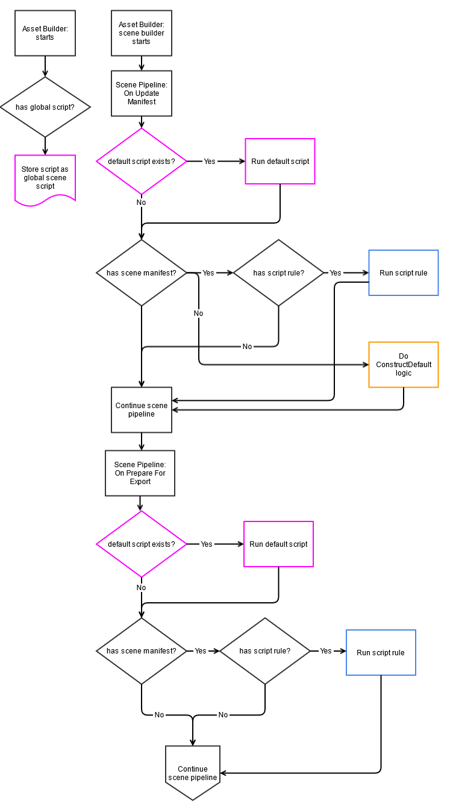

### Summary

The current scene pipeline allows content creators to assign a Python script to modify a source scene export definition by updating the scene manifest. This feature will allow content creators to assign a Python scripts to modify the scene processing logic for any group of source scene assets.

The current scene pipeline allows each source scene asset to link a Python script to modify its processing logic, but the current scene pipeline requires each source scene asset to be updated in order to use a Python script. This pipeline does not scale since it requires a manual step for each source scene asset. This is a cumbersome and error prone process that would benefit from a global mechanism to assign a default Python script to use for any source scene asset.

### What is the relevance of this feature?

The default scene builder script feature addresses these shortcomings by adding a global mechanism to assign default Python scripts during the scene building pipeline for each source scene asset.

These are some common use cases that will be addressed by this work.

 - As a technical artist, I want to be able to set the default logic to generate a procedural prefab for our FBX files in the "props" folder.
 - As a technical content creator for a robotics team, I want to route the scene processing logic to detect motor and sensor nodes in scenes so that we can automatically create proper entity components via Python scripts.
 - As a tech artist, I want to be able to read the user defined properties inside a FBX file in a default scene Python script so that it can route the scene pipeline to the correct Python scripts to process the source scene.

The proposed solution will handle each of these use cases.

### Feature design description

The proposed solution is to allow teams to assign Python scripts to source scene assets. The Python scripts will be assigned to the source scene assets using file path matching patterns. These patterns and Python script references will be stored in the registry settings.

A team of technical content creators (e.g. technical artists) create default Python scripts that will be applied to any source scene assets (FBX, GLTF, STL). Then the team will add project registry settings to set the default Python scene builder script.

Terms

 - Source Scene Assets - the files that contain render elements like geometry, lights, and materials such as a GLTF or FBX file. The STL file format is also supported but it is limited to geometry and materials.
 - Scene Pipeline Script - A Python script that is executed at certain phases along the scene pipeline
 - Scene Manifest - A list of rules for scene builders to use to export scene produce product assets (normally stored in a side car file name ``*.assetinfo``)
 - Scene Graph - An in-memory representation of the source scene asset such as mesh data, transform data, and animation data


### Technical design description

The ScriptProcessorRuleBehavior allows Python scripts to hook into the "Update Manifest" and "Export Products" phase events.

This process flow patch will allow the current scene pipeline to continue to work, but it will allow teams to modify the scene pipeline Python scripts either per source scene asset (via the scene manifest) or by setting up a default Python script to handle scene processing.

The normal scene processing flow will run the default builder behaviors (via Events::AssetImportRequest::ConstructDefault) if no scene manifest is present or a default Python script does not modify the scene manifest.

The configuration will be handled in the settings registry. The default scripts will be linked by matching a key to the script path value. For example:

```
{
  "O3DE": {
    "AssetProcessor": {
      "SceneBuilder": {
        "defaultScripts": {
          "game_settings/items": "@projectroot@/scripts/item_builder.py",
          "game_settings/props": "@projectroot@/scripts/prop_builder.py",
          "game_settings/characters": "@projectroot@/scripts/character_builder.py"
        }
      }
    }
  }
}
```



This diagram shows the normal scene logic flow as it gets to the "On Update Manifest" event and the "On Prepare for Export" event. The pink elements will be added to the scene logic flow to discover and execute default scene building scripts. The blue elements are executed if a script processing rule is found in the scene manifest. The yellow element constructs the default scene logic if no scene manifest is discovered.

The default scene building script will run before examining the current scene manifest since the default scene building script might inject custom script handlers that might run as part of the "has script rule?" condition.

### What are the advantages of the feature?

The feature scales well with projects that contain many source scene assets that want the same basic logic. The settings registry keys will apply the Python scene building script if the scene asset path matches the key pattern.

For example, if a default Python script reads in the folder location "the_project/props/boxes" then a key "the_project/props" will route the prop source asset to the "my_projects/tools/scripts/props.py" module to extract each mesh in that scene as a separate mesh group. These are all configured inside the settings registry.

#### Use cases with the proposed solution

This section examines the use cases listed above using the proposed solution.

> 1, As a technical artist, I want to be able to set the default logic to generate a procedural prefab for our FBX files in the "props" folder.

The proposed solution enables tech artists to set default scene scripts that can determine the type of the scene file (either by examining the file path and/or examining the UDP metadata) then execute the "ImportProps.py" library to update the scene's manifest rules as a "game prop" prefab, collision mesh, and LODs.

> 2, As a technical content creator for a robotics team, I want to route the scene processing logic to detect motor and sensor nodes in scenes so that we can automatically create proper entity components via Python scripts.

The proposed solution sorts out this issue by allowing the script author to add a default scene script that can search the scene nodes for UDP metadata that indicates the type of robotics sensor or motor then add a custom component (e.g. SensorPackageComponent) to a new Prefab Group.

> 3, As a tech artist, I want to be able to read the user defined properties inside a FBX file in a default scene Python script so that it can route the scene pipeline to the correct Python scripts to process the source scene.

The proposed solution solves this use case because a default scene script can be used as a router so that each scene can be examined and assign the correct import logic. The logic can perform an import logic flow per contained node inside the scene file and use the entire scene to place these individual parts.

For example, a race track might have a single mesh for a light pole for an entire track. The script could route the scene to the "TrackImport.py" module to create a Mesh Group for the light post, find the places for the light posts, and finally create an entity inside the Prefab Group for each light post translated in their place on the track.

### What are the disadvantages of the feature?

The solution has a few disadvantages including forcing the scene pipeline to load the script for each source scene asset file matching a pattern and the framework will need to be enabled to start processing.

Since a default scene build script will be executed for each source scene asset file that matches a pattern there is a risk that a Python script will slow down the scene build pipeline if the script is inefficient. The risk is created by the team’s technical content authors so it will be mitigated by the external team. The Helios team can assist alleviating this risk by providing extra metrics around how long builder scripts are running.

The feature is an opt-in feature so this can be another disadvantage since the team will need to know about the feature in order to use it. This can lead to confusion to a team that expects the new feature to already be executing. This risk can be mitigated by advertising the feature on the AP GUI user interface, document the feature, and by announcing the feature on the web site’s blog.

### How will this be implemented or integrated into the O3DE environment?

This feature will be developed in the Scene Processing gem and the Scene API library. The Scene Processing gem will load the script configuration when it activates. This will provide the script configuration to the Scene API.

The feature will be implemented script execution in the script processor rule logic inside the Scene API library. During the scene building events for updating the scene manifest and the export products events a default scene building script will be executed. This logic will execute with any other Python scene building script for these events. The default script will execute first then the custom scripts.

### Are there any alternatives to this feature?

An alternative to this solution is to write a Python asset builder that runs with all source scene asset files such as FBX or GLTF. Combined with the intermediate assets feature, the Python asset builder could duplicate most of this feature by copying the FBX file to the intermediate file plus add a scene manifest (.assetinfo) file next to it.

The biggest drawback to this method would be that the Scene API library would also process all source scene asset files so this would be doubling the effort to process source scene assets. This likely would also double the time to process all the scene files. The copy to the intermediate folder would also double the space required to process all the scene files. Finally, there would almost no mechanisms to hook this Python asset builder script into the Editor to show the parts of the scene that were updated by a script.

### How will users learn this feature?

The users will learn about this feature by announcing it in the O3DE blog and updating the Asset Processing public documentation. The feature can be exposed on the tools page of the AP GUI user interface.

It might be useful to include an office tutorial video to demonstrate how to set up Python scene building scripts including a default scene building script.

### Are there any open questions?

These are some open questions and potential scenarios that should be considered during development.

Q: What happens if a source scene asset has no scene manifest sidecar file?

Right now if the foo.fbx.assetinfo file that contains the scene manifest file is missing, then the default construction manifest rules are used to export the source scene asset. After this feature is complete, if no .assetinfo sidecar file is present then the default script will be run then the “construct default” logic will be run.

If the .assetinfo sidecar file is present then execution steps will be default script and scene manifest script, but none of the construct default logic will be run.

**Q: Should the tech ignore the default script if the manifest script exists?**

No. The concept of the default scene building script is to apply the logic for each source scene asset file even if the scene manifest rules a script rule. There might be some ways for the default scene script to indicate the changes to the scene manifest so far, but the teams will need to figure out how to align the individual script rules and the default scene scripts.

**Q: Should the the manifest script rule to override some behaviors defined in the default script?**

No. It is better for all the scripts to execute for a source scene asset than to block scripted logic based arbitrary scene pipeline rules. The teams will be able to determine how to align local script rules (via the scene manifest) and a default scene script.

**Q: Can this feature be configured so that the script to run on certain source scene assets?**

The concern here seems to be that executing a Python script for each source scene asset might cause slow downs in a mature content pipeline such as a game team. The mitigation plan for this is to add metrics to the system to attempt to detect the length of time the Python scripts are taking and address solutions based on customer feedback.

**Q: Have we considered a max time or any limits to prevent long running scripts?**

It is possible to interrupt an embedded Python script call, but there are a few issues that would need to be have good design patterns such as allowing the content teams to set the time limit (possibly by script) and attempt to avoid writing out corrupted data.

**Q: How will the feature treat patterns that match multiple default scripts?**

For example:

```
"game_settings/props": "@projectroot@/scripts/prop_builder.py",
"game_settings/props/balls": "@projectroot@/scripts/prop_builder_ball.py"
```

There are a few options here. First, the feature could execute each script it finds that matches. Another option is to execute the first script that matches. This functionality can evolve as customers come back with their feedback.
