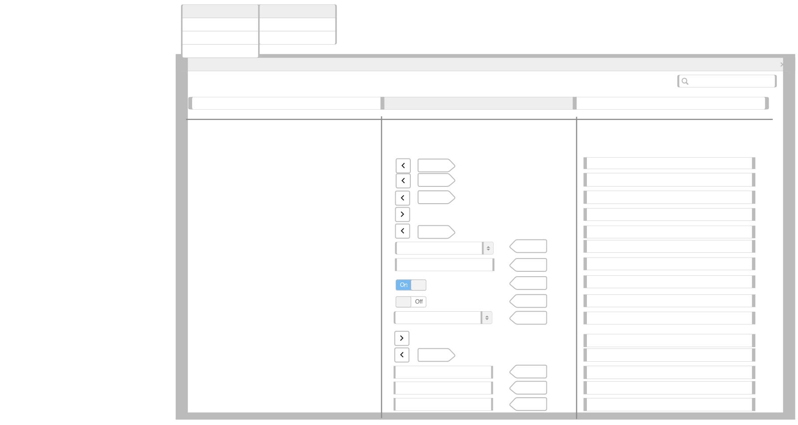
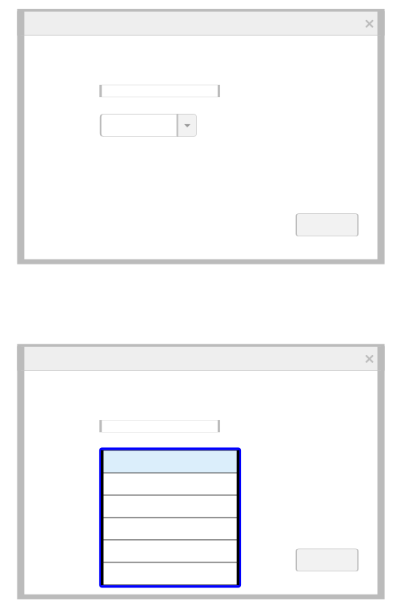
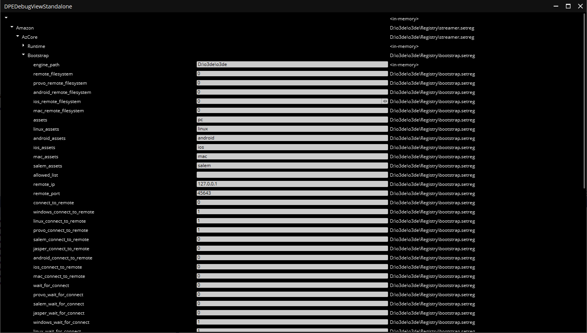
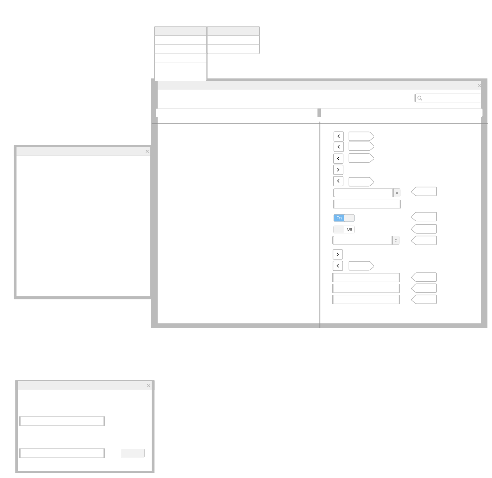

- [Settings Registry UI Editors](#settings-registry-ui-editors)
  - [Current status](#current-status)
  - [Brief Summary](#brief-summary)
  - [Stakeholders](#stakeholders)
  - [Technical Design](#technical-design)
    - [Settings Registry In-Memory Editor](#settings-registry-in-memory-editor)
      - [Programmer created UX Diagram for the Settings Registry In-Memory Editor](#programmer-created-ux-diagram-for-the-settings-registry-in-memory-editor)
    - [Settings Registry File Editor](#settings-registry-file-editor)
      - [Programmer created UX Diagram for the Settings Registry File Editor](#programmer-created-ux-diagram-for-the-settings-registry-file-editor)
      - [Settings Registry File Browser](#settings-registry-file-browser)
    - [Settings Registry Origin Tracking](#settings-registry-origin-tracking)
      - [Explanation](#explanation)
      - [Requirements](#requirements)
      - [`<engine-root>/Registry/bootstrap.setreg`](#engine-rootregistrybootstrapsetreg)
      - [`<project-root>/Registry/bootstrap.setreg`](#project-rootregistrybootstrapsetreg)
      - [**command line**](#command-line)
      - [API](#api)
        - [**Settings Registry Origin API**](#settings-registry-origin-api)
    - [Scope](#scope)
    - [Testing plan](#testing-plan)
    - [Execution Plan (And Dependencies)](#execution-plan-and-dependencies)
    - [Phase 1](#phase-1)
    - [Phase 2](#phase-2)
    - [Post-Launch](#post-launch)
    - [Migration Plans (Data, and workflows)](#migration-plans-data-and-workflows)
  - [Risks](#risks)
    - [System Risk](#system-risk)
    - [Implementation Risk](#implementation-risk)
    - [Alternatives](#alternatives)
    - [Make a Settings Registry Viewer only](#make-a-settings-registry-viewer-only)
      - [Why Not?](#why-not)
      - [Why?](#why)
  - [FAQ](#faq)
    - [Why two separate editors(In-Memory, File) instead of one editor?](#why-two-separate-editorsin-memory-file-instead-of-one-editor)

# Settings Registry UI Editors

## Current status

## Brief Summary

O3DE provides a feature known as the Setting Registry, which allows aggregation of configuration data("settings") from a myriad of O3DE object locations(engine, gems, projects) and merges them into an in-memory Document Object Model(currently a JSON document) that users can query or modify in the C++ applications.  
The feature being requested here is to add support for a UI Editor that can query and make modifications to the Setting Registry.  
The customer for this feature are developers and designers that desire to update settings used by O3DE applications.  

The proposed feature here is to add a Gem which exposes two DOM Widgets for modifying the Settings Registry.  
The first of which is the Settings Registry In-Memory Editor, which would only be available as a widget within the Editor, to allow users to examine and modify the global registry that is loaded within the Editor  

A new Settings Registry Adapter which on the Document Property Editor [DocumentAdapter](https://github.com/o3de/o3de/blob/d451cdd36be2f625218f6f79377cbf9118bead2d/Code/Framework/AzFramework/AzFramework/DocumentPropertyEditor/DocumentAdapter.h) will be created that provides a model of the Settings Registry data itself.  
The Settings Registry Adapter would provide additional context data for querying and modifying the Settings Registry by tracking the "origin" location of which Settings Registry files(`*.setreg`/`*.setregpatch`) files provided a particular settings and the value of that setting at the time of reading.  
This allows Settings Registry In-Memory Editor to know which files correspond to the settings they are viewing are being viewed.

  
The second widget is the Settings Registry File Editor, which would be available as both a widget that can be docked within the Editor and a standalone executable.  
The Settings Registry File Editor would be able to load 1 or more .setreg files and write them back out to disk.

The Settings Registry File Editor will not need the origin tracking facility as it will only be able to view actual .setreg file contents.  
It will be able to merge additional .setreg files into the existing instance as well as export that content back out to disk.  

  

Furthermore those settings can be persisted back to the in-memory registry or to the file system.  

See github issue for more detail: [https://github.com/o3de/o3de/issues/2218](https://github.com/o3de/o3de/issues/2218)

## Stakeholders

| Team | Description |
| --- | --- |
| sig-ui-ux | For the design of the UI Editors layout and workflow |
| sig-content | For the creation of the Document Object Model that can be feed into the Document Property Editor(DPE) |
| sig-core | For any backend changes that needs to be made to the Settings Registry code to support tracking the origin of settings |

## Technical Design

The Settings Registry UI has the the following shared requirements

* Support for Editing the following types

1. Aggregate Types: JSON Object and JSON Array
1. Basic Types: JSON Boolean, JSON Integer, JSON Float, JSON String  
    * Aggregate Types can be created, removed or have children elements added to them
    * Basic Types can be created, removed or edited

* There should be an option to copy the selected settings to the clipboard as JSON

### Settings Registry In-Memory Editor

The Settings Registry In-Memory Editor has set of requirements that differ from those of the Settings Registry File Editor.  
The requirements specific specific to the in-memory editor is below.

*   Changes to the registry in the DOM Editor should be able to be written back to the associated Settings Registry instance
*   The Settings Registry UI AP should allow feature systems to make their own Settings Registry DOM widgets associated with local instances of the Settings Registry
*   The source ("origin") of where settings were last read from should be available within the Settings Registry In-Memory Editor(not required for the File Editor).  
    This allows the Settings Registry Editor to display from which file a particularly setting is sourced.
*   The Settings Registry UI Gem will will provide a general Settings Registry In-Memory Editor widget that models the Global Settings Registry by default.

#### Programmer created UX Diagram for the Settings Registry In-Memory Editor

The following is a simple diagram of how the Settings Registry Editor could look.





The Add Field entry for the Value could be model as such




The Actions for the file listed in the diagram are explained below

| Action | Description |
| --- | --- |
| Reload Registry | Reloads settings data stored in the associated in-memory Settings Registry back into the Widget |
| Store to Registry | Updates the associated in-memory Settings Registry with the modifications |
| Exit | Closes the Settings Registry In-Memory Editor.  <br>If the registry contains modifications, optionally prompt the user to request if they want to use the "Store to Registry" option |

| Edit Action | Description |
| --- | --- |
| Copy Selected as JSON | Takes the selection of settings keys and uses their settings recursively to clipboard in JSON format |
| Select Root | Select the root("") Settings Registry Key.  <br>Side Note: Copying that key copies the entire registry |

  

Below is a prototype of image of how the Standalone Document Property Editor looks, when modeling the Settings Registry system.

How the Settings Registry Editor prototype currently looks is based on the code that is in development that added the Settings Registry Editor: [https://github.com/o3de/o3de/pull/11404](https://github.com/o3de/o3de/pull/11404)

**Sample Image**



### Settings Registry File Editor

The Settings Registry File Editor provides slightly different options and capabilities than the Settings Registry In-Memory Editor.  
The view is mostly the same, but there are some differences. The File Editor would not track the origin of where settings are sourced, since the user opened the settings registry via the UI.  
  
The requirements for the Settings Registry File Editor is as follows

* `.setreg` and `.setregpatch`` files should be able to be opened within the Settings Registry File Editor and isolated into a Local Setting Registry instance - See the [SettingsRegistryBuilder.cpp](https://github.com/o3de/o3de/blob/d451cdd36be2f625218f6f79377cbf9118bead2d/Code/Tools/AssetProcessor/native/InternalBuilders/SettingsRegistryBuilder.cpp#L219-L270) for an example of making a local Settings Registry instance which is used to isolate settings in the Asset Processor based on the output platform, launcher type and build configuration.
* Additional .setreg and .setregpatch files should also be able to be merged against an existing Settings Registry instance opened in the DOM. This allows users to see merged results of that file. This should be as simple as calling [SettingsRegistryInterface::MergeSettingsFile](https://github.com/o3de/o3de/blob/d451cdd36be2f625218f6f79377cbf9118bead2d/Code/Framework/AzCore/AzCore/Settings/SettingsRegistry.h#L428-L438) to perform the merge.
* The Settings Registry Editor File should provide an option for exporting the opened instance to the file system.  
    * The export capability should also support saving specific sections of the Settings Registry via using JSON pointer for filtering.  
        The [Output the Settings Registry with C++](https://docs.o3de.org/docs/user-guide/settings/output-settings-registry/) page provides instructions on how to this.
* A standalone tool executable that can launch the Settings Registry File Editor should be available as a target when building the Gem.

#### Programmer created UX Diagram for the Settings Registry File Editor


  

| File Action | Description |
| --- | --- |
| Open Registry | Opens a JSON file and loads its settings into a new Settings Registry Editor Document instance |
| Merge Registry | Opens a JSON file and merges the contents to the current Settings Registry Editor Document instance. <br>JSON files with .setreg or any other extension are merged using the [JSON Merge Patch](https://datatracker.ietf.org/doc/html/rfc7386) Algorithm. <br>JSON files with .setregpatch extension are merged using the [JSON Patch](https://datatracker.ietf.org/doc/html/rfc6902) Algorithm. |
| Export to File | Saves the Settings Registry Editor Document to a file path specified to a export wizard. <br>The wizard itself supports an "anchor" entry for specifying a section of the Settings Registry to using [JSON Pointer Syntax](https://datatracker.ietf.org/doc/html/rfc6901#section-5). <br>Only the JSON objects anchored below that section is written to the file. |
| Close Registry | Closes the Settings Registry Editor Document that is currently open  <br>If there are unsaved modifications, optionally prompts the user to ask if they want to use the "Export to File" option. |
| Exit | Closes the Settings Registry File Editor |

| Edit Action | Description |
| --- | --- |
| Copy Selected as JSON | Takes the selection of settings keys and uses their settings recursively to clipboard in JSON format |
| Select Root | Select the root("") Settings Registry Key. <br>Side Note: Copying that key copies the entire registry |

  

#### Settings Registry File Browser

The Settings Registry File Browser that is part of the Settings Registry File Editor will contain a customizable filter model to be used to filter which .setreg/.setregpatch files are shown within the file browser.  
This allows specific sysetms that desire to expose a Settings Registry File Editor as a widget which can edit specific settings registry files that fulfills a naming scheme.

For example the XR gem might want to expose an XR Settings Registry File Editor widget that allows modifying any .setreg file that has a tag of "xr" as part of it's file name.  
Given a directory with Settings Registry files

```
<o3de engine root>/
Registry/
bootstrap.setreg
graphic_settings.xr.setreg
audio_settings.xr.setreg
asset_processor.setreg
Platform/
Android/
metaquest2.xr.setreg
vfs.setreg
```

The XR gem could provide a filter model that will only show in the Settings Registry File Browser with the naming scheme of `<filename>.xr.setreg`


By default the Settings Registry File Browser filter will list the `.setreg`/`.setregpatch` files that are part of the [Settings Registry search locations](https://docs.o3de.org/docs/user-guide/settings/developer-documentation/#search-locations)

### Settings Registry Origin Tracking

This section will explain why the origin of where settings are read from is needed by the Settings Registry Editor and the requirements of the origin tracking.

#### Explanation

The Settings Registry is class that wraps a JSON Document and provides functionality to query and set values within that document based on JSON Pointer syntax.  
Furthermore it allows merging of settings using either the [JSON Patch](https://datatracker.ietf.org/doc/html/rfc6902) or [JSON Merge Patch](https://datatracker.ietf.org/doc/html/rfc7386) Algorithms.  
Settings can be merged from
1. [JSON string read from memory](https://github.com/o3de/o3de/blob/d451cdd36be2f625218f6f79377cbf9118bead2d/Code/Framework/AzCore/AzCore/Settings/SettingsRegistry.h#L420-L427)
2. [JSON formatted files on disk](https://github.com/o3de/o3de/blob/d451cdd36be2f625218f6f79377cbf9118bead2d/Code/Framework/AzCore/AzCore/Settings/SettingsRegistry.h#L428-L457)
3. The [\--regset or --regset-file command line options](https://github.com/o3de/o3de/blob/d451cdd36be2f625218f6f79377cbf9118bead2d/Code/Framework/AzCore/AzCore/Settings/SettingsRegistryMergeUtils.cpp#L1260-L1276)  

More information about the Settings Registry merge API can be found at the [Settings Registry API Examples](https://docs.o3de.org/docs/user-guide/settings/developer-api/#merge-api) page.  

Because of the different locations settings can be merged from, the origin of where settings are loaded from needs to be tracked to provide the user with that information.  
Furthermore the value of that setting when that it was merged to the Settings Registry needs to be tracked in order to know if the setting has been modified.

#### Requirements

As setting values are be merged over each other, a particular settings key might have multiple "origins", that needs to be tracked.

Here is an example scenario, where there are settings being sourced from

1.  The `<engine-root>/Registry` folder
2.  Followed by the `<project-root>/Registry`
3.  Followed by being overwritten on the command line
4.  And finally being set explicitly in C++ code.

#### `<engine-root>/Registry/bootstrap.setreg`

```json
{
    "O3DE": {
        "Settings": {
            "ArrayValue": [
                5,
                7,
                40000000,
                -89396
            ],
            "ObjectValue": {
                "StringKey1": "Hello",
                "BoolKey1": true
            }
        }
    }
}
```

#### `<project-root>/Registry/bootstrap.setreg`

```json
{
    "O3DE": {
        "Settings": {
            "ArrayValue": [
                27,
                39,
                42
            ],
            "ObjectValue": {
                "IntKey2": 9001
            },
            "DoubleValue": 4
        }
    }
}
```

#### **command line**


`user@host $ Editor.exe --regset` `"/O3DE/Settings/StringKey1=Goodbye"`

**C++ code**

```c++
if (auto settingsRegistry = AZ::SettingsRegistry::Get(); settingsRegistry != nullptr)
{
    settingsRegistry->Set("/O3DE/Settings/StringKey1", "Hi");
    settingsRegistry->Set("/O3DE/Settings/ArrayValue/0", -5);
}
```

Once the Settings Registry merges in all settings from the above sources, the in-memory settings registry would look like the following

**In-Memory**

```json
{
    "O3DE": {
        "Settings": {
            "ArrayValue": [
                -5,
                39,
                42
            ],
            "ObjectValue": {
                "StringKey1": "Hi",
                "BoolKey1": true,
                "IntKey2": 9001
            },
            "DoubleValue": 4
        }
    }
}
```

  
For the above settings, the origin stack could looks as follows

| Setting Key | Origin Stack (First entry is top of stack) |
| --- | --- |
| "/O3DE" | 1. Path: `<engine-root>/Registry/bootstrap.setreg` |
| "/O3DE/Settings" | 1. Path: `<engine-root>/Registry/bootstrap.setreg` |
| "/O3DE/Settings/ArrayValue" | 1. Path: `<engine-root>/Registry/bootstrap.setreg` |
| "/O3DE/Settings/ArrayValue/0" | 1. Path: "<C++ Code>"<br>2. Path: `<project-root>/Registry/bootstrap.setreg`<br>3. Path: `<engine-root>/Registry/bootstrap.setreg` |
| "/O3DE/Settings/ArrayValue/1" | 1. Path: `<project-root>/Registry/bootstrap.setreg`<br>2. Path: `<engine-root>/Registry/bootstrap.setreg` |
| "/O3DE/Settings/ArrayValue/2" | 1. Path: `<project-root>/Registry/bootstrap.setreg`<br>2.  Path: `<engine-root>/Registry/bootstrap.setreg` |
| "/O3DE/Settings/ArrayValue/3" | 1. Path: `<engine-root>/Registry/bootstrap.setreg` |
| "/O3DE/Settings/ObjectValue" | 1. Path: `<engine-root>/Registry/bootstrap.setreg` |
| "/O3DE/Settings/ObjectValue/StringKey1" | 1. Path: "\<C++ Code>"<br>2. Path: "\<command line>"<br>3. Path: `<engine-root>/Registry/bootstrap.setreg` |
| "/O3DE/Settings/ObjectValue/BoolKey1" | 1. Path: `<engine-root>/Registry/bootstrap.setreg` |
| "/O3DE/Settings/ObjectValue/IntKey2" | 1. Path: `<**project-root>/Registry/bootstrap.setreg` |
| "/O3DE/Settings/DoubleValue" | 1. Path: `<project-root>/Registry/bootstrap.setreg` |

#### API

The Settings Registry Origin Tracker API can be found in the SettingsRegistryOriginTracker header

##### **Settings Registry Origin API**

The Settings Registry Origin API is link in [SettingsRegistyOriginTracker.h](https://github.com/o3de/o3de/blob/d451cdd36be2f625218f6f79377cbf9118bead2d/Code/Framework/AzCore/AzCore/Settings/SettingsRegistryOriginTracker.h#L24-L81).  

In order to ease with debugging of the Settings Registry Origin Tracker values as well as to allow a user to get a text dump of the tracked settings, a console command has been registered to allow dumping the map of setting keys to file origins.

A new console command of [sr_dump_origin](https://docs.o3de.org/docs/user-guide/settings/az-console/#use-the-sr_dump_origin-command-to-output-the-filepath-that-last-modified-a-key) has been added for such as case. The command `sr_dump_origin` stands for "Settings Registry Dump File Origin".  

### Scope

* [~~COMPLETED - Hook Settings Registry Tracking into the Application startup~~](https://github.com/o3de/o3de/blob/d451cdd36be2f625218f6f79377cbf9118bead2d/Code/Framework/AzCore/AzCore/Component/ComponentApplication.cpp#L597-L601) - The Editor would need to install hooks to track the origin of the Settings Registry
* [~~COMPLETED - Document Property Editor~~](https://github.com/o3de/o3de/blob/d451cdd36be2f625218f6f79377cbf9118bead2d/Code/Framework/AzFramework/AzFramework/DocumentPropertyEditor/SettingsRegistryAdapter.h#L19-L54) - Adapters would need to be added to the Document property Editor to allow visualization of the Settings within the DOM Widgets.
* Create the Settings Registry UI Editor Gem - The actaul creation of the Settings Registry Editor Gem stills needs to be done and the QT widgets created for it.  


### Testing plan

| Phase | Description |
| --- | --- |
| ~~DONE - Simulated Testing~~ | C++ Unit test to be added that simulates the commands of making an edit to the Settings Registry In-Memory Editor and serializing the changes back to the In-Memory editor.<br>Those test are located in the [SettingsRegistryOriginTrackerTests.cpp](https://github.com/o3de/o3de/blob/d451cdd36be2f625218f6f79377cbf9118bead2d/Code/Framework/AzCore/Tests/Settings/SettingsRegistryOriginTrackerTests.cpp) |
| Feature Testing | Manual Testing during feature development will be performed to validate the UI meets the acceptance criteria outlined in the Feature Request: https://github.com/o3de/o3de/issues/2218 |


### Execution Plan (And Dependencies)

The work needed to support an in Settings Registry Editor can be broken to the following high level task

### Phase 1

The primary focus of phase 1 is to add support for viewing the global Settings Registry in the Editor, followed by being able to open up files in a standalone Settings Registry Editor application.  
Bold task are higher priority. 

| Task | Description |
| --- | --- |
| ~~**COMPLETED - Create an class to track the Settings Registry .setreg/.setregpatch files a settings is sourced from**~~ | Add a class to track the file origin location of settings within the Settings Registry itself.  <br>This work will use the Pre Merge and Post Merge hooks added to the Settings Registry in this PR: https://github.com/o3de/o3de/pull/3023 |
| ~~**COMPLETED - Create a Document Object Model Adapter that provides a model for the Settings Registry In-Memory Editor**~~ | Create a DOM Adapter that provides a model for the Settings Registry that can be used to adapt data from a SettingsRegistryInterface instance. This work has been completed as of PR https://github.com/o3de/o3de/pull/11404 |
| **Creating Settings Registry Editor UI Gem** | Create a Settings Registry Editor Gem that implements the source code for the Settings Registry Editor Widget  <br>This can use the [CppToolGem](https://github.com/o3de/o3de/tree/d451cdd36be2f625218f6f79377cbf9118bead2d/Templates/CppToolGem) template to make a Gem which comes with a dockable editor widget. |
| **Implement a Qt Widget for Settings Registry In-Memory Editor** | The QT Widget for the Settings Registry In-Memory Editor will be hooked into the Editor view pane using the [RegisterViewPane](https://github.com/o3de/o3de/blob/d451cdd36be2f625218f6f79377cbf9118bead2d/Code/Framework/AzToolsFramework/AzToolsFramework/API/ToolsApplicationAPI.h#L742-L749) function in the ToolsApplication API |
| Create a Document Object Model Adapter that provides a model for the Settings Registry File Editor | Create a DOM Adapter for the [Document Property Editor](https://github.com/o3de/o3de/tree/d451cdd36be2f625218f6f79377cbf9118bead2d/Code/Framework/AzFramework/AzFramework/DocumentPropertyEditor) that provides a model for the Settings Registry that can be used to adapt data from a Settings Registry instance |
| Implement a Qt Widget for the Settings Registry File Editor | The QT Widget for the Settings Registry File Editor will be hooked into the Editor view pane using the [RegisterViewPane](https://github.com/o3de/o3de/blob/d451cdd36be2f625218f6f79377cbf9118bead2d/Code/Framework/AzToolsFramework/AzToolsFramework/API/ToolsApplicationAPI.h#L742-L749) function in the ToolsApplication API |
| Create a standalone Application for the Settings Registry File Editor | As part of Settings Registry Editor Gem, a `SettingsRegistry.Editor` EXECUTABLE CMake target will be added that derices from the [Application](https://github.com/o3de/o3de/blob/d451cdd36be2f625218f6f79377cbf9118bead2d/Code/Framework/AzFramework/AzFramework/Application/Application.h#L44) class to wrap the Settings Registry File Editor widget in a Qt Application. <br>The [AzQtComponents::StyleManager](https://github.com/aws-lumberyard-dev/o3de/commit/234cfebfee0099a7a7cd07a11ff5f7d3254c6fd9#diff-9fe0a24bc023842de4e59df457e41bfba21399e71a2bb6ee3c2f0528f87d8507R105-R136) should be used to ensure the same UI styling as the O3DE Editor is used |

  

### Phase 2

Work that that is need for the Settings Registry Editor to reach Minimum Viable product status


<style>
.info {
    background-color: #e7f3fe;
    border-left: 6px solid #2196F3;
}
</style>


<table class="fixed-table wrapped"><colgroup><col style="" /><col style="" /><col style="" /></colgroup>
<tbody>
<tr>
<th>Task</th>
<th>Description</th>
</tr>
<tr>
<td style="text-align: right;">
Implement In-Place editing for Settings Registry DPE</td>
<td>Make sure the Document Property Editor for the Settings Registry supports in-place editing of String, Int, Bool and Double entries.</td></tr>
<tr>
<td style="text-align: right;">
Add Support to create new settings</td>
<td>Add Support to create new settings | New settings should be able to be created via the "Add Field" button next to the Value entry of a existing Object or Array entry.<br> <div class="info">The <a href="https://github.com/o3de/o3de/blob/d451cdd36be2f625218f6f79377cbf9118bead2d/Code/Framework/AzCore/AzCore/Settings/SettingsRegistry.h#L420-L427">SettingRegistryInterface::MergeSettings</a> can be used to add new empty object and array fields in the Settings Registry.</div>
</td></tr>
</tbody></table>


```c++
// Create String, int, double or bool
settingsRegistry->Set(fieldKeyPath, /*<AZStd::string | AZ::s64/AZ::u64 | double | bool>*/);

// Create empty Object
settingsRegistry->MergeSettings("{}", AZ::SettingsRegistryInterface::Format:: JsonMergePatch, fieldKeyPath);

// Create empty Array
settingsRegistry->MergeSettings("[]", AZ::SettingsRegistryInterface::Format:: JsonMergePatch, fieldKeyPath);
```
  

### Post-Launch

The following nice to haves can be implemented into the Settings Registry UI Editors after launch

| Task | Description |
| --- | --- |
| (Epic) Add Undo/Redo Support for Settings Modifications | Implement support for an undo/redo command buffer, that allows users to undo modifications to settings they made in both the In-Memory and File Editor |
| (Epic) Support for multiple .setreg(document) file editing | This task is for the Settings File Editor only. Support for workflow where users can open multiple .setreg files in different tabs of the File Editor and make modifications to those settings registry in isolation of each other ala the Script Canvas Editor. |

  

### Migration Plans (Data, and workflows)

Not Applicable. There is no data being migrated anywhere.

## Risks

### System Risk

| Risk | Mitigation |
| --- | --- |
| Less technical users could accidently override engine, Gem, or project settings with incorrect settings values using the Settings Registry File Editor | Since the engine, Gem and project settings Registry directory is source controlled, the changes could be rollback to a previous commit, or the diff can be examined to determine the user intent |
| Users could copy application transient settings(temporary) out of the Settings Registry In-Memory Editor and save it to a .setreg file in source controlled Registry folder and then commit that file to source control.  <br>Those runtime settings would get loaded by default in that case | The Asset Processor SettingsRegistryBuilder will never merge transient or excluded settings to the aggregate bootstrap.game.<config>.setreg file, so the launchers will not be initialized with excluded settings. <br>The JSON paths for transient and excluded settings are specified in the [setregbuilder.assetprocessor.setreg](https://github.com/o3de/o3de/blob/d451cdd36be2f625218f6f79377cbf9118bead2d/Registry/setregbuilder.assetprocessor.setreg#L22-L29) file. |
| Semantic value of the Settings aren't not validated.  <br>If a settings field should only be allowed to be set to a constrained set of values, the Settings Registry Editor will not be able enforce that. <br>For example the [/Amazon/AzCore/Bootstrap/remote\_port](https://github.com/o3de/o3de/blob/d451cdd36be2f625218f6f79377cbf9118bead2d/Registry/bootstrap.setreg#L9) setting semantically supports an ip port number which can only be between (0-65535).  <br>However any kind of integral value from \[0 ,2^64) is allowed to be entered. | Documentation will be needed for most settings in general to document their value ranges and constraints on them. <br>A schema format such as [JSON Schema](https://json-schema.org/draft/2020-12/json-schema-core) would need to be integrated into the Document Property Editor API. |

### Implementation Risk

The implementation of the Settings Registry UI Editors, would rely on the Document Property Editor(DPE) whic is a work in progress.  
The implementer of this feature could require features and API that are not available as part of the Document Property Editor Adapter API to be added.  

### Alternatives

### Make a Settings Registry Viewer only

For the Settings Registry In-Memory Editor, one alternative is to create a only a viewer of the settings with no editing capabilities.

#### Why Not?

The reason that this only shouldn't be pursued is that splitting the design into two UI Widgets for the Settings Registry In-Memory Editor and File Editor was done with making it simpler to add editing functionality for the global Settings Registry.  
Furthermore the in-memory Settings Registry can already viewed within the editor using the console command of `sr_regdump`/`sr_regdumpall`.

#### Why?

A Settings Registry Viewer would still have the benefit of having a column that indicates the file origin of a setting, so it provides a use case that users currently don't have.  
A Copy to Clipboard command can be added to replicate the behavior of copying the dumped JSON of the `regdump` command.  
* It is simpler to implement UX wise.  
* Functionality such as input fields aren't required.  
* Logic to write back to the associated settings registry instance is also not needed.  
* A Settings Registry File Viewer can still provide the .setreg/.setregpatch merge functionality. <br>It can also provide export to file capabilities as well.<br>The only piece that would be missing is the actual editing of input fields.

## FAQ

### Why two separate editors(In-Memory, File) instead of one editor?

While the Settings In-Memory Editor and File Editor share a source for the data being viewed or edited (`SettingsRegistryInterface` instance), there are some features of each editor that would be make it prone to user error when combined.  
It also increases the amount of decisions that need to be made with user input.  

For example allowing the user to export the In-Memory Settings Registry to a file makes it really easy for a user to mistakenly propagate their user's settings to the project.  
Since the In-Memory Settings Registry contains all the merged settings from the engine (`<engine-root>/Registry`), loaded gems(`<gem-root>/Registry`), the project shared settings(`<project-root>/Registry`), the project per user settings(`<project-root>/user/Registry`), and the user machine settings(`~/.o3de/Registry`), if a user exported that entire registry to a file in the project registry(`<project-root>/Registry`), then their user settings would also be part of that file.  
Furthermore the In-Memory Settings Registry contains settings that are transient and only created at runtime to help with passing application runtime settings around (ex. `/O3DE/Runtime/CommandLine` - Stores the command line in the registry).  
Not all of the settings in the In-Memory Settings Registry are applicable for export.

On the other end of the spectrum, having to take into account newly merged .setreg when tracking the "origin" of settings makes the implementation complicated.  
For example if the user loads the global settings registry into the UI Editor and then merge a .setreg file from the filesystem into the UI Editor, then additional issues come up.  
For the newly merged updated settings the "origin" value would need to be updated.

Several user facing questions come up as well.  
* Are all the "origins" where settings are sourced from available from the view within the Settings Registry Editor or only the "last origin?  
* If the origin being shown in the Settings Registry Editor, can I as a user export modifications of those settings to the files represented by that origin?

Finally decisions about which features are available would have to be made as well.  
* For a single file editor, would the user be able to merge a .setreg from the file system over the in-memory registry?  
* How about vice-versa? Would the user be able to merge the in-memory registry over a loaded .setreg instance?  
* Would the user be able to export the modified in-memory editor with merged .setreg files back to the filesystem?  
Addressing each of topics adds a considerable amount of complexity to the implementation of such a feature and could be addressed at a later date.  

