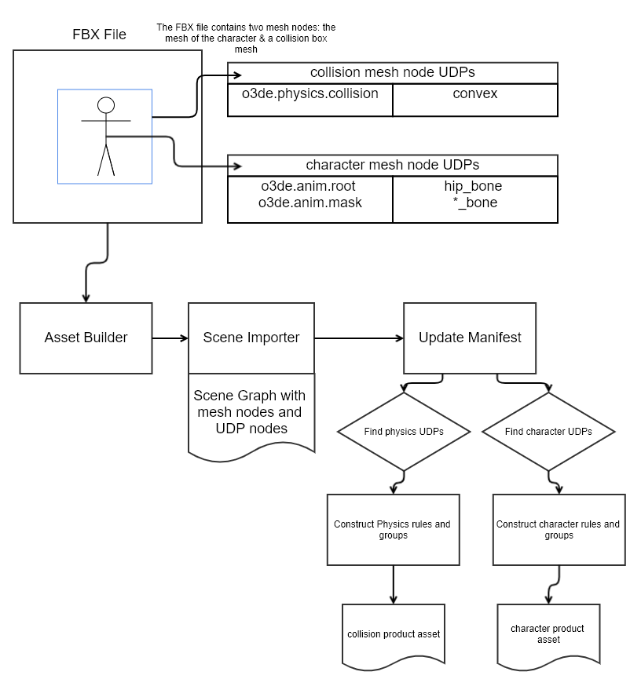

# Summary

All the digital content creation (DCC) tools such as Autodesk Revit, Maya, and Blender can embed metadata into the scene nodes. This metadata describes important details about the 3D geometry such as geo-spatial elements, optimization flags, and real-world data tags. As the size and complexity of 3D content creation increases, these user defined properties (UDP) metadata reduces the friction to manage and process these complex assets.

# What is the relevance of this feature?

Currently artists have a few ways to storing metadata from the source scenes into exported source scene files (i.e FBX files) such as naming schemes. This metadata is important since it can indicate details about the scene such as mesh nodes to be used as level of detail (LOD) and physics parameters. The best way to store this type of metadata is to use the properties sub-systems used inside the DCC tool then export those user defined properties into file formats that can persist those properties such as FBX, IFC, and glTF. 

The scene builder will read in this UDP metadata so that tech artists can write Python scripts to process scene node data to produce intended product outputs like LODs, mesh optimizations, material assignments, and physics data. 

These are some example of how the O3DE engine teams can use these UDP metadata:

- Add mesh optimization flags per mesh node
- Tagging level of detail meshes along with distant ranges
- Add physics data such as material data and/or flag a collision mesh
- Visual material assignments and parameters
- Flag certain nodes to separate CAD meshes like electrical, foundation, or plumbing
- Storing manufactured tags for ASIN part numbers per 3D model

# Feature design description

The main features that will be added with adding UDP metadata into the scene building pipeline includes reading key-value pairs per node in the scene graph, exposing the UDP metadata to Python script hooks, and enable custom art pipelines into the O3DE engine.

The AssImp library has a custom properties data structure to capture node metadata that is imported from FBX, glTF, and IFC source scene files. This allows the scene importer to store the UDP metadata uniformly as a key-value pair where the key is a string and a value can be a Boolean, integer, or float value.

The behavior context will be able to return the node contents to Python scripts so that complex scene building scripts can be written to add components with metadata values. It is also possible to tag meshes as LODs, collision meshes, and material properties using the UDP metadata.

Finally, importing the UDP metadata will allow teams to adopt interchangeable data files like FBX so that they will incorporate their favorite DCC tools to load and update the FBX files. This allows teams to have more flexibility to interop with the same source scene files the O3DE engine import.



# Technical design description

The implementation will add a new scene importer for custom UDP metadata, incorporate a new ‘import custom properties’ event, and expose the custom property node content to Python scripting.

There is a solid pattern in the SceneAPI to add new scene graph node data, so the work here is to create a new scene graph data type (i.e. CustomPropertyData), add a new loading component (i.e. AssImpCustomPropertyImporter), and wire up the new component inside the scene builder.

The behavior context will be used to get the custom property data so that the Python bindings can extract the property key-value map. This map will be a read-only mapping of custom data points that the Python scripts can use to update the scene manifest rules and/or create extra asset product files.

## Prototype

A prototype was created back in 'December 2021' to demonstrate the patterns and implementation that could be used to finish this feature.

This is located at https://github.com/o3de/o3de/pull/6430

As an example, this is how the Python code accesses the UDPs:

```
def print_properties_manifest(scene):
    scene_graph = scene_api.scene_data.SceneGraph(scene.graph)
    node = scene_graph.get_root()
    children = []
 
    while node.IsValid():
        if scene_graph.has_node_child(node):
            children.append(scene_graph.get_node_child(node))
 
        node_name = scene_api.scene_data.SceneGraphName(scene_graph.get_node_name(node))
        node_content = scene_graph.get_node_content(node)
        if node_content.CastWithTypeName('CustomPropertyData'):
            if len(node_name.get_path()):
                print(f'>>> CustomPropertyMap {node_name.get_path()}')
                props = node_content.Invoke('GetPropertyMap', [])
                for index, (key, value) in enumerate(props.items()):
                    print(f'>>>> index:{index} key:{key} value:{value}')
 
        if scene_graph.has_node_sibling(node):
            node = scene_graph.get_node_sibling(node)
        elif children:
            node = children.pop()
        else:
            node = azlmbr.scene.graph.NodeIndex()
```

An example in C++ of accessing the UDP custom property map:

```
const auto customPropertyData = azrtti_cast<const DataTypes::ICustomPropertyData*>(graph.GetNodeContent(propertyDataIndex));
if (!customPropertyData)
{
	AZ_Error("prefab", false, "Missing custom property data content for node.");
	return;
}

const auto propertyMaterialPathIterator = customPropertyData->GetPropertyMap().find("o3de.default.material");
if (propertyMaterialPathIterator == customPropertyData->GetPropertyMap().end())
{
	return;
}

const AZStd::any& propertyMaterialPath = propertyMaterialPathIterator->second;
if (propertyMaterialPath.empty() || propertyMaterialPath.is<AZStd::string>() == false)
{
	AZ_Error("prefab", false, "The 'o3de.default.material' custom property value type must be a string."
							  "This will need to be fixed in the DCC tool and re-export the file asset.");
	return;
}

// find asset path via node data
const AZStd::string* materialAssetPath = AZStd::any_cast<AZStd::string>(&propertyMaterialPath);
if (materialAssetPath->empty())
{
	AZ_Error("prefab", false, "Material asset path must not be empty.");
	return;
}
```

# What are the advantages of the feature?

The scene builder will read in this UDP metadata so that tech artists can write Python scripts to process scene node data to produce intended product outputs like LODs, mesh optimizations, material assignments, and physics data.

# What are the disadvantages of the feature?

This feature is an opt-in feature so current scene building logic will continue until game content teams utilize this feature. 

# How will this be implemented or integrated into the O3DE environment?

The AssImp scene loading logic will be updated to read in UDP metadata and create scene graph node content that asset processing logic will be able to access the UDP metadata latter in the scene building pipeline.

When each node for AssImp is examined, the build logic will look for AssImp metadata per node. If AssImp metadata is found, the logic will create a custom property scene graph node to store the key-value pairs. 

The stored values will support value types for a string, a Boolean, a integer 32-bit and 64-bit, float, and double. 

The scene graph node custom properties will be accessed using the behavior context via Python hooks. It will also be possible to access the scene graph node custom properties via C++ as well using the behavior context.

# Are there any alternatives to this feature?

The current technique being used is to name a node a specific format such as "mesh_lod0" which indicates this mesh should be used as a LOD at level Zero. The drawbacks of this technique:

- naming schemes are brittle becoming easy to misspell
- hard to reuse the node for multiple metadata types such as LOD and Physics data
- giving values to keys in a naming technique makes names messy and fragile

# How will users learn this feature?

This feature will be announced in the Discord channel (sig-content) and this RFC will be posted to get preliminary notice. Once the feature is submitted, a blog post will be written to properly announce it pointing to how it will solve some common use cases. The blog post will point to documentation to help tech artists get started. 

This is the sort of feature that will require a team to come up with a plan of how to store key-value metadata, have pipeline scripts read in the metatdata, and have the scripts produce new content based on the UDP metadata.

The O3DE team will be able to start promoting certain scene content features by using the 'o3de' namespace to describe scene node details such as:

- 'o3de.render.lod = 0'
- 'o3de.render.mesh_optimize = 0.123'
- 'o3de.render.material = car_metal.mtl'
- 'o3de.physics.material = metal'

# Are there any open questions?

No.

