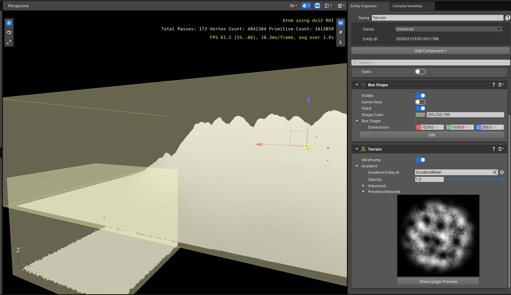
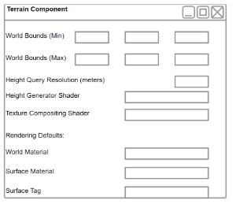
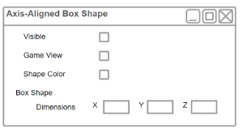
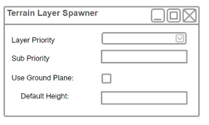
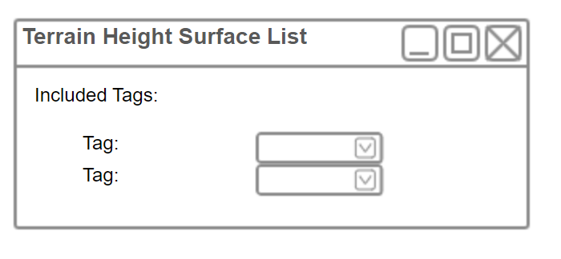
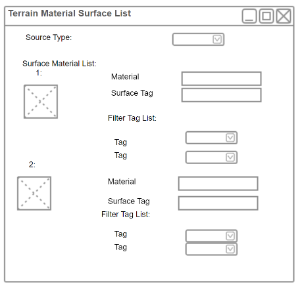
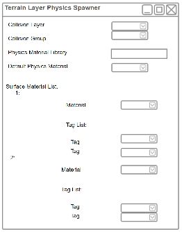
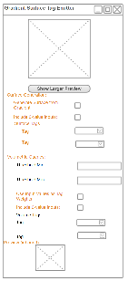

# O3DE Terrain System

### Summary:
This document describes implementation of a "terrain system", as defined by the following:
* Height, color, and surface data mapped to regions of the world
* Authoring tools and workflows that support data creation / modification and how to map it to regions
* A system that allows this data to be queried and used by both simulation and rendering
* Specialized rendering as needed to support efficient, high-quality terrain visualization across the view distance
* One or more physics surfaces that can be used to provide a "physical" simulation of the terrain in the virtual world

### What is the relevance of this feature?
O3DE currently has no terrain system.  Customers can individually create their own terrain systems with enough time and expense, but terrain is a broad enough need across games and industries that it would be a significant benefit to all o3de customers to have an existing terrain system in place when first adopting the engine.  Additionally, the terrain system should be architected in a way that various aspects of it can be extended and improved over time (new input data formats, better rendering techniques, revised low-level streaming, etc).

Once completed, this system will enable customers to:
* Import height, color, and surface data
* Assign that data to regions of the virtual world
* Render the data as a textured terrain mesh
* Represent the terrain in PhysX as a physics surface
* Query the terrain at runtime via an API to get height, color, and surface data at specific points or regions

### Feature design description:
Terrain is authored via the standard entity component pattern and designed to handle an unlimited number of terrain height fields, color regions, and surface materials. This pattern provides a developer-friendly authoring environment supporting parallel workflows and extremely large worlds.  The backend terrain system gathers data across the multiple entities and presents it as a unified set of terrain data to all other systems that need to interoperate with it.

Authoring begins with an entity and a shape component to define a terrain location and size in the world. Gradient components and Surface Data components are then layered together, defining height, color, and surface data, which forms the visual look.  With an optional Gradient Component edit mode, users can manually paint and modify height, color, and/or surface data directly in the viewport with a brush manipulator.  Connectivity is driven via the Terrain Level Component that bridges communications with other systems (rendering, physics, particles, gameplay) and provides a consistent world grid and output regardless of how many different terrain entities exist or where they are placed.  Terrain rendering uses the authored height / color / surface data to produce heightmap-based mesh generation and composited color / surface textures that are then rendered with Atom.  Terrain physicalization uses the same authored height and surface data to produce physics heightmaps for efficient collisions and surface queries for use within PhysX.

Prototype image demonstrating multiple heightmap entities and their interaction with Gradient components:


### Technical design description:
There are multiple aspects to this design - the component design, the API design, the backend system, and the renderer.

#### Terrain Level Component


The terrain system begins with a terrain level component that defines the overall terrain system parameters for the level.  This component establishes that terrain should exist in this level, and it defines the overall data-quantizing grid size being used across the entire level.  Regions of the level can provide different levels of fidelity to their data, but rendering, physics, and other systems will query that data based on this grid size.

Other system-level parameters can be provided here as well, such as a default rendering material, a default physics material, etc. 

NOTE: This might get split up into separate level components for the terrain system, the terrain rendering system, and the terrain physics system to provide better decoupling between the systems.

#### Axis-Aligned Box Shape Component


Terrain data regions for height, color, and surface types are defined by entities containing a shape component.  For simplicity, the design will specifically be constrained initially to use a new Axis-Aligned Box Shape (AABB) component, which is a variant of the existing Box Shape component, but it intentionally doesn't support rotation.  Eventually, the terrain system could be extended to other shape types if desired.  By not supporting rotation at the start, it simplifies the problem of handling the regions on the boundaries (triangulation, etc).

#### Terrain Layer Spawner Component


To make terrain exist in a region, an AABB plus a Terrain Layer Spawner component would be added to an entity.  The Terrain Layer Spawner makes all height, color, and surface data in the region available to the back-end terrain system, which then makes the data available to the renderer and to physics.

#### Terrain Height Surface List Component


Height data is defined in a region through an AABB plus a Terrain Height Surface List component.  This would use any height data "broadcast" from Gradient and Surface Data components in the region based on the provided tags.  Initially, if multiple surfaces overlap, it will take the highest point, but this could eventually be extended to provide more complicated logic.

#### Terrain Macro Material Component


Color/normal/roughness/etc data is defined in a region through an AABB and a Terrain Macro Material component.  The data in the Macro Material will be composited into the final rendered terrain.

#### Terrain Material Surface List Component


Surface materials for rendering are defined in a region through an AABB and a Terrain Material Surface List component.  This maps surface data "broadcast" from a Surface Data component to what's typically known as a surface "splat map" to define the blend amount of surface material that appears at any given point in the region.

#### Terrain Layer Physics Spawner Component


The Terrain Layer Physics Spawner Component "physicalizes" terrain in the given region by spawning a physics heightmap for that region.  The component also maps surface data "broadcast" from a Surface Data component to the physics data, so that the physics system has a set of physics surface weights within it as well.

#### Gradient Surface Tag Emitter (modifications)


The Gradient Surface Tag Emitter component already exists, but for the overall terrain system design proposed here to work for common terrain use cases, this component will need to be enhanced.  Since all of the above components work off of Surface Tags and surface weights, and the common use case for terrain is to input this data via image-based maps into Image Gradients, the Gradient Surface Tag Emitter needs the ability to broadcast surface data instead of just modify it.

#### APIs
The terrain system will have a set of query request APIs and notification APIs.  The initial design for this already exists in o3de at AzFramework/Terrain/TerrainDataRequestBus.h, but will be expanded further, as seen below.  The query APIs provide for synchronous and asynchronous queries of both single points and regions.

```
/////////////////////////////////////////////////////////////////////////////////////////////////////
class TerrainDataRequests
{
    enum class Sampler
    {
        BILINEAR,   // Get the value at the requested location, using terrain sample grid to bilinear filter between sample grid points
        CLAMP,      // Clamp the input point to the terrain sample grid, then get the exact value
        EXACT,       // Directly get the value at the location, regardless of terrain sample grid density
  
        DEFAULT = BILINEAR
    };
 
  
    enum SurfacePointDataMask
    {
        POSITION        = 0x01,
        NORMAL          = 0x02,
        SURFACE_WEIGHTS = 0x04,
          
        DEFAULT = POSITION | NORMAL | SURFACE_WEIGHTS
    };  
  
  
    struct SurfaceWeight
    {
        AZ::Crc32 m_surfaceType;
        float m_weight;
    };
  
    typedef AZStd::function<void()> TerrainDataReadyCallback;
    typedef AZStd::function<void(const SurfaceData::SurfacePoint& surfacePoint, uint32_t xIndex, uint32_t yIndex)> SurfacePointRegionFillCallback;
  
    // System-level queries to understand world size and resolution
  
    virtual AZ::Vector2 GetTerrainGridResolution() = 0;
    virtual AZ::Aabb GetWorldBounds() = 0;
  
    // Synchronous single input location.
  
    // Given an XY coordinate, return the elevation.  The Vector3 input position version is defined to ignore the input Z value.
    virtual float GetHeight(const AZ::Vector3& inPosition, Sampler sampleFilter = DEFAULT, bool* terrainExistsPtr = nullptr) = 0;
    virtual float GetHeightFromVector2(const AZ::Vector2& inPosition, Sampler sampleFilter = DEFAULT, bool* terrainExistsPtr = nullptr) = 0;
    virtual float GetHeightFromFloats(const float x, const float y, Sampler sampleFilter = DEFAULT, bool* terrainExistsPtr = nullptr) = 0;
  
  
    // Given an XY coordinate, return a position with that XY coordinate and the correct elevation.  The Vector3 input position version is defined to ignore the input Z value.
    virtual AZ::Vector3 GetPosition(const AZ::Vector3& inPosition, Sampler sampleFilter = DEFAULT, bool* terrainExistsPtr = nullptr) = 0;
    virtual AZ::Vector3 GetPositionFromVector2(const AZ::Vector2& inPosition, Sampler sampleFilter = DEFAULT, bool* terrainExistsPtr = nullptr) = 0;
    virtual AZ::Vector3 GetPositionFromFloats(float x, float y, Sampler sampleFilter = DEFAULT, bool* terrainExistsPtr = nullptr) = 0;
  
    // Given an XY coordinate, return the surface normal.  The Vector3 input position version is defined to ignore the input Z value.
    virtual AZ::Vector3 GetNormal(const AZ::Vector3& inPosition, Sampler sampleFilter = DEFAULT, bool* terrainExistsPtr = nullptr) = 0;
    virtual AZ::Vector3 GetNormalFromVector2(const AZ::Vector2& inPosition, Sampler sampleFilter = DEFAULT, bool* terrainExistsPtr = nullptr) = 0;
    virtual AZ::Vector3 GetNormalFromFloats(float x, float y, Sampler sampleFilter = DEFAULT, bool* terrainExistsPtr = nullptr) = 0;
  
  
    // Given an XY coordinate, return the max surface type and weight.  The Vector3 input position version is defined to ignore the input Z value.
    virtual SurfaceWeight GetMaxSurfaceWeight(const AZ::Vector3& inPosition, Sampler sampleFilter = DEFAULT, bool* terrainExistsPtr = nullptr) = 0;
    virtual SurfaceWeight GetMaxSurfaceWeightFromVector2(const AZ::Vector2& inPosition, Sampler sampleFilter = DEFAULT, bool* terrainExistsPtr = nullptr) = 0;
    virtual SurfaceWeight GetMaxSurfaceWeightFromFloats(float x, float y, Sampler sampleFilter = DEFAULT, bool* terrainExistsPtr = nullptr) = 0;
  
  
    // Given an XY coordinate, return the set of surface types and weights.  The Vector3 input position version is defined to ignore the input Z value.
    virtual void GetSurfaceWeights(const AZ::Vector3& inPosition, SurfaceTagWeightMap& outSurfaceWeights, Sampler sampleFilter = DEFAULT, bool* terrainExistsPtr = nullptr) = 0;
    virtual void GetSurfaceWeightsFromVector2(const AZ::Vector2& inPosition, SurfaceTagWeightMap& outSurfaceWeights, Sampler sampleFilter = DEFAULT, bool* terrainExistsPtr = nullptr) = 0;
    virtual void GetSurfaceWeightsFromFloats(float x, float y, SurfaceTagWeightMap& outSurfaceWeights, Sampler sampleFilter = DEFAULT, bool* terrainExistsPtr = nullptr) = 0;
  
    // Given an XY coordinate, return all terrain information at that location, or optionally a subset based on the dataMask.  The Vector3 input position version is defined to ignore the input Z value.
    virtual void GetSurfacePoint(const AZ::Vector3& inPosition, SurfacePoint& outSurfacePoint, SurfacePointDataMask dataMask = DEFAULT, Sampler sampleFilter = DEFAULT) = 0;
    virtual void GetSurfacePointFromVector2(const AZ::Vector2& inPosition, SurfacePoint& outSurfacePoint, SurfacePointDataMask dataMask = DEFAULT, Sampler sampleFilter = DEFAULT) = 0;
    virtual void GetSurfacePointFromFloats(const float x, const float y, SurfacePoint& outSurfacePoint, SurfacePointDataMask dataMask = DEFAULT, Sampler sampleFilter = DEFAULT) = 0;
  
    //! Returns true if there's a hole at location x,y.
    //! Also returns true if there's no terrain data at location x,y.
    virtual bool GetIsHoleFromFloats(float x, float y, Sampler sampleFilter = Sampler::BILINEAR) const = 0;

    // sync/async per-point processing for a list.  Pass in an onComplete callback to turn this into an async call, potentially on a different thread.
    // API variations (like ProcessHeightsFromVector2List) can be added over time if needed.
  
    virtual void ProcessHeightsFromList(const AZStd::vector<AZ::Vector3>& inPositions, SurfacePointRegionFillCallback perPositionCallback, Sampler sampleFilter = DEFAULT, TerrainDataReadyCallback onComplete = nullptr) = 0;
    virtual void ProcessNormalsFromList(const AZStd::vector<AZ::Vector3>& inPositions, SurfacePointRegionFillCallback perPositionCallback, Sampler sampleFilter = DEFAULT, TerrainDataReadyCallback onComplete = nullptr) = 0;
  
    virtual void ProcessSurfaceWeightsFromList(const AZStd::vector<AZ::Vector3>& inPositions, SurfacePointRegionFillCallback perPositionCallback, Sampler sampleFilter = DEFAULT, TerrainDataReadyCallback onComplete = nullptr) = 0;
    virtual void ProcessSurfacePointsFromList(const AZStd::vector<AZ::Vector3>& inPositions, SurfacePointRegionFillCallback perPositionCallback, SurfacePointDataMask dataMask = DEFAULT, Sampler sampleFilter = DEFAULT, TerrainDataReadyCallback onComplete = nullptr) = 0;
  
    // sync/async per-point processing for a region.  Pass in an onComplete callback to turn this into an async call, potentially on a different thread.
  
    virtual void ProcessHeightsFromRegion(const AZ::Aabb& inRegion, const AZ::Vector2 stepSize, SurfacePointRegionFillCallback perPositionCallback, Sampler sampleFilter = DEFAULT, TerrainDataReadyCallback onComplete = nullptr) = 0;
    virtual void ProcessNormalsFromRegion(const AZ::Aabb& inRegion, const AZ::Vector2 stepSize, SurfacePointRegionFillCallback perPositionCallback, Sampler sampleFilter = DEFAULT, TerrainDataReadyCallback onComplete = nullptr) = 0;
    virtual void ProcessSurfaceWeightsFromRegion(const AZ::Aabb& inRegion, const AZ::Vector2 stepSize, SurfacePointRegionFillCallback perPositionCallback, Sampler sampleFilter = DEFAULT, TerrainDataReadyCallback onComplete = nullptr) = 0;
    virtual void ProcessSurfacePointsFromRegion(const AZ::Aabb& inRegion, const AZ::Vector2 stepSize, SurfacePointRegionFillCallback perPositionCallback, SurfacePointDataMask dataMask = DEFAULT, Sampler sampleFilter = DEFAULT, TerrainDataReadyCallback onComplete = nullptr) = 0;
};

class TerrainDataNotifications
{
    enum TerrainDataChangedMask
    {
        SETTINGS         = 0x01,
        HEIGHT_DATA      = 0x02,
        MACRO_COLOR_DATA = 0x04,
        SURFACE_DATA     = 0x08
    };   
    virtual void OnTerrainDataChanged(const AZ::Aabb& dirtyRegion, TerrainDataChangedMask dataChangedMask) {}

    virtual void OnTerrainDataCreateBegin() {}
    virtual void OnTerrainDataCreateEnd() {}

    virtual void OnTerrainDataDestroyBegin() {}
    virtual void OnTerrainDataDestroyEnd() {}
};
 
```

#### Scripting support
There are two different sets of APIs that will be made available via BehaviorContext to scripting systems:
1. The terrain query APIs listed above (or a relevant subset) will be exposed for use directly from lua / ScriptCanvas / etc.
2. The components will expose APIs for more directly manipulating the data and parameters that they use.

#### Back-end terrain system
Each level will have a single instance of the terrain system instantiated if the Terrain Level component exists.  All of the components listed above provide various aspects of terrain data, but the back-end system is the one that runs every tick to query the data, composite it, and update the various terrain representations as needed.  This system is also the one that provides the API listed above to provide a CPU-side view into the terrain data.

This system will keep track of the set of active terrain spawning regions in the world and also refresh the terrain representations as needed as different spawners activate and deactivate.

#### Terrain rendering
A terrain rendering feature processor will handle the terrain rendering.  This feature processor is responsible for the following:
* Breaking the terrain mesh into discrete units (ex: 32 m x 32 m squares) that can be individually LODded or culled.
* LOD selection for each discrete unit.
* Generating a renderable mesh for each discrete unit.
* Providing LOD blending / transitions as needed.
* Compositing the color and surface data into texture information for each discrete unit.
* Managing mips and blending of the texture information.

The implementation of this still needs investigation and refinement, but will most likely consist of the following:
* Adaptive virtual texturing for managing the height and texture data
* CDLOD (continuous LOD) for blending between LODs
* A quadtree or octree structure to support the high-level management of each discrete unit
* Heightmap-based deformation of a regular grid to produce the mesh

The terrain renderer queries the terrain back-end system to get the appropriate height, color, and surface data for each discrete unit, and then caches and manages the data as needed while rendering.

#### Terrain physics
The terrain physics spawner component will handle the interaction with PhysX through the physics APIs.  For each region in which physics will be spawned, the component will query the terrain back-end system to get the appropriate height and surface data, which will then be turned into a physics heightmap and spawned in through the physics APIs, ultimately leading to a PhysX representation.

### What are the advantages of the feature?
This feature will make it easier for artists, designers, and other content creators to produce a high-quality terrain in their environment without relying on engineering support to build new underlying systems to support their terrain needs.

### What are the disadvantages of the feature?
The primary disadvantages are complexity and performance.  This design decouples the different aspects of terrain to improve the system's flexibility and extensibility over time, as well as its ability to scale in complexity and fidelity.  But the cost of this decoupling is that the initial learning curve will be higher than for tightly-coupled terrain systems.  It also will be less performant than a tightly-coupled system, since each piece will make less assumptions and impose fewer constraints. 

The initial learning curve can be improved over time through community involvement in creating tutorials and examples.

The performance characteristics will be monitored throughout development to ensure that it is at least "performant enough" for most common user scenarios.

### How will this be implemented or integrated into the O3DE environment?
This will be implemented within a Terrain Gem that can be optionally enabled or disabled for a project.

### Are there any alternatives to this feature?
There are some alternatives that have been considered and ruled out, at least for this initial implementation.
* Alternate 3D mesh representations (voxelization, TINs, displacement maps, geometry images, etc) - these aren't initially being supported, due to fewer authoring toolsets supporting them, the difficulties in high-performance rendering, and the lack of physics support.  The component design and APIs are being designed with 3D data in mind though, so that variations like these could be added later.
* Spherical / planetary representations - this is out of scope for the design and architecture of this system.  While the proposed design should extend and work for "unwrapped" planets that are turned into flat planes, completely different technology would be needed to handle the different coordinate systems, meshing, physics, etc, required by non-flat worlds.

### How will users learn this feature?
Initially via documentation, but ideally the community will eventually provide tutorials as well.

At some later point, when the editor supports data-driven entity templates (via prefabs or other means), the initial learning curve could be simplified via a terrain template with a functioning initial entity/component setup.

### Are there any open questions?

#### What about (voxels, TINs, etc) support?
As covered above, these aren't a part of the initial implementation, but the proposed design should allow for these extensions over time.

#### How will this perform with games that have high-speed low-flying vehicles, high-speed high-flying vehicles, and ground characters?
This remains an open question.  These three scenarios have very different system needs.  The design is optimized for high-fidelity terrain at ground level, and should also be able to handle the case of flying vertically up and down rapidly.  "Horizontal" performance is going to be driven by how fast the various compositing systems listed above end up running.  It should be possible to optimize by simplifying or pre-compositing sets of data, but until portions of the system are built, it's hard to know how the performance will translate to travel speeds. 

#### Will the terrain data be modifiable at runtime?
Yes, though with scaling performance costs, depending on the extent of the modification, the complexity of the terrain data, and the complexity of other data relying on the terrain (vegetation, objects snapped to terrain, physics objects on the terrain, etc).  All of the components and interactions between them are designed to allow for the terrain to change if/when the data on the components change.  This mechanism is used equally for editing terrain in the Editor, loading/unloading portions of terrain via prefabs, and arbitrarily through the BehaviorContext at runtime.  The implementation will be similar to the Dynamic Vegetation system, in that component activations / deactivations / changes will trigger dirty region updates in the underlying terrain system, which will query the components for the changed data and send out change notifications as appropriate.

#### What about decals and roads?
These aren't covered by the terrain system, but the design is allowing for these ancillary systems to be built over time.  They could be built by extending the various surface material systems described above to support "directional materials", so that the road surface can follow a spline or tube shape for example.  This could then be composited into the same surface types and texture compositing steps as every other surface type.

#### What about terrain holes?
Initially, you should be able to create holes in the sense that you can author terrain entities in a way that portions of the world simply don't have terrain.  Later iterations of the system could allow for per-vertex holes fairly easily by adding gradient-based alpha channels.  This system is unlikely to support per-pixel holes due to a number of system challenges (physics support, rendering complexity, etc) coupled with the observation that per-pixel support is a level of granularity that's generally been unnecessary in a terrain system.

#### How will indirect lighting, reflections, and terrain shadows work? 
TBD.  Since the rendering plan above is to generate meshes used by Atom, the meshes _should_ be able to support the same types of lighting and shadowing as other meshes, but that still needs to be verified.

#### How does this work relative to streaming?
The terrain system as proposed above has no built-in streaming support.  It is designed to leverage other streaming systems that get built over time, without directly needing to rely on or have any knowledge of them.  The height / color / surface data is controlled by entities, so any sort of entity streaming system that gets built should be compatible.  Customers could also write a simple streaming system via lua or Script Canvas that loads and unloads specific region-based spawnables as the camera moves.  The data _used_ by those entities is a combination of procedural noise functions that don't require streaming and image-based data that will have mip-level streaming. 

#### How will coordinate precision issues for large coordinates be addressed?
Specifically, the problem is that with floating-point numbers, precision gets cut in half at every power of two, so you have 1 mm precision at 8 km, 2 mm at 16 km, 4 mm at 32 km, etc.  When discussing terrain, this question comes up when discussing how well the system will handle arbitrarily large terrain sizes.  Until/unless the o3de engine addresses coordinate precision issues holistically (position data storage, camera-relative rendering, physics support, etc), it will be difficult to specifically determine how well the terrain system handles these larger sizes.  The precision issue is considered to be outside the scope of this RFC.

#### How will raycasting be exposed?
There are multiple answers to this, depending on the use case and the system doing the querying:
* For "snap to terrain" style queries (i.e. raycasts that point directly downwards on the Z axis), the various "GetHeight" / "GetPosition" APIs listed in the API section should be used.  These will provide the highest terrain point directly underneath the input position.
* For arbitrary raycasts for use in the Editor and/or other unidentified subsystems, it's possible that a generic raycast vs terrain API will need to be written and exposed.  This support will be deferred until there's a use case, but it seems like a reasonable extension to add.  The primary design question around the API is whether or not it needs to support multiple casts and/or asynchronous results, or just a single synchronous raycast.  The use case(s) will make this more evident at the time of implementation.  At a minimum, it would implement RenderGeometry::IntersectionRequestBus for single-point-synchronous queries if the raycast API is needed.
* For raycasts used for physics, the most efficient approach would be to spawn a physics terrain and use raycasts in the physics system itself.
* For raycasts used for rendering purposes, the exact needs and implementations are TBD based on use cases.

#### Why is this specifically targeting PhysX?
The terrain system will be built using the generic physics APIs, so it isn't specifically targeting PhysX.  However, PhysX is the only physics system currently available in o3de, so the concrete implementation of the system will ultimately use PhysX and be tested with that system.

#### What are the edit-time and runtime file storage formats?
The formats are somewhat user-configurable:
* The input image data to Image Gradients can be in a variety of formats, with 8-bit, 16-bit, and 32-bit formats supported, as well as some specialized terrain formats (terrarium, geotiff, etc).
* The runtime image format for Image Gradients defaults to custom serialized 32-bit data, but can be changed to different formats via asset exporter settings.  The format will likely be changed over to standardize on the Atom streamingimage format to allow for system enhancements like streaming mipmap support, but this will be determined during implementation.
* Color textures and surface materials use standard Atom input and output texture formats.

#### Are there plans to "bake" the edit-time data?
The gradient components and Landscape Canvas have been designed in a way that it should be possible to create an intermediate edit-time component anywhere in the gradient node graph to "bake" (or "squash and merge" if you prefer :) ) any subset of the data to reduce the runtime computations, while still preserving the ability to dynamically load/unload/modify it in different ways at runtime.  As time permits, this feature will be added during implementation, but this can also be built entirely independent of the terrain effort.

#### Can 16-bit numbers be used to save memory?
They can be used within any individual Image Gradient, but the current plan for the back-end terrain system is to use 32-bit floats everywhere.  The design currently provides for multiple ways to control memory usage:
* Independent resolution and storage size controls for each defined terrain region
* Ability to manually dynamically load and unload each terrain entity via prefabs/spawnables
* Controls over virtual texture cache sizes
* Ability to simply not define data for any region in which terrain isn't used.

Support for both 32-bit floats and 16-bit ints internally and through the API purely as a memory savings technique would add complexity for questionable value relative to the other memory controls provided.

#### Is there a way to directly share data between the various decoupled terrain systems (physics, rendering, back-end terrain system, etc)?
This is definitely an outstanding question that will get revisited over time.  Initially, the various systems are expected to have their own copies of the data.  This is due to decoupling of the systems, different data formats, different caching strategies, and different tessellation resolutions.  Any sharing of data is likely to cause a much tighter coupling between the systems, and less flexibility in how each system gets used.  However, this will continue to get scrutiny during implementation to see if there are any opportunities for data sharing without causing negative design and architecture effects. 

#### What about performance metrics?
The system will get instrumented at various levels during implementation, but the specific metrics have yet to be determined.  The focus will be on memory and CPU usage, as well as any GPU-side instrumentation needed for terrain to appear within the Atom metrics.

#### By using Surface Data components as inputs, as well as _generating_ surface data as an output, couldn't things get a bit confusing, create data cycles, etc?
Yep, it's definitely possible.  During development, we'll examine this design approach vs using Gradients more directly as inputs - i.e. possibly creating a "Terrain Height Gradient List" component instead of a "Terrain Height Surface List" component.  It would also be possible to provide both as options, if they both prove out to have value in certain circumstances.

