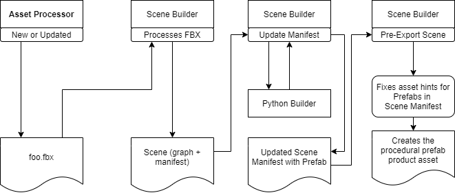

# Scene Manifest Procedural Prefab Output Feature

## Problem/Opportunity

Technical asset pipeline developers want to write out prefab products assets from a source scene asset. The pipeline developers want to use scripts to split up complex scenes from source files, to tag entities with game information, and to create complete entity-component trees with assigned assets.

The current workflow that involves exporting the scene from the DCC, using the O3DE Editor to tweak settings by removing the default mesh grouping, adding new mesh groupings, creating an entity-component tree in the Editor, assigning the meshes and materials to the entities, and finally save out the entity-component tree as a prefab asset. If the artist changes the scene again somebody will need to go through these manual steps again. The proposed system eliminates the manual workflow by allowing scripts to generate the scene to a prefab asset using the specifications by the artist.

### Additional Background / Terminology

The scene manifest has a number of rules that explain what product assets to create from a source scene file such as a FBX file. A scene can output product assets such as mesh groups, LODs, animation clips, physics models, and materials. A natural extension to this would be game time Prefab product assets that can describe how to assemble an entity-component tree hierarchy.

The main reason the teams want this is to manage the prefab levels and entity trees closer to their Digital Content Creation (DCC) packages like Maya. The scripts will be able to output the same product assets on each machine, which will ensure that scripts will out deterministic prefabs and updated prefabs from the DCC package.

Terminology
- Prefab – A prefabricated description of an entity-component tree in a JSON document
- Spawnable - A prefab asset that has been compiled into a spawnable prefab asset, content that can be loaded dynamically while a game is running.
- Authored Prefab - A prefab that was created by a content creator via the O3DE Editor, and is tracked as a source asset.
- Procedural Prefab - A prefab that is output from this new system, a prefab that only exists in the asset cache and is not hand authored.
- Scene File – A file that describes the 3D data such as meshes, cameras, lights, and materials organized in a node hierarchy; example file extensions FBX, DAE, STP
- Scene Manifest – a document paired with a Scene File to describe a rule set used to export product assets from a scene
- Digital Content Creation Package (DCC Package) – this is a digital asset creation package such as Blender, Maya, or 3D Studio Max
- Keystone – code name for the team and technology that collects an entity-component tree into an asset normally authored in the Editor
- Technical pipeline developers - people that are in charge of preparing assets for the O3DE engine to consume; they typically use Python scripts or even C++ code to extend the asset pipeline to transform and/or prepare custom assets

## Requirements and Scope

The plan is to create a new scene manifest rule Prefab Group that writes out a Prefab product described inside a scene manifest. The Editor will be able to load this Prefab product asset to place into project scenes. A new component will be added to link a reference to this new scene Prefab product asset.

### Tenets

- We provide workflows for tech artists to work mostly in the tools they are most comfortable using to produce engine art assets.
- We allow user defined customizations to allow game teams to extend the art pipeline from DCC tools and extending the asset pipeline.
- We provide easy to follow JSON formats to enable technical pipeline developers to extend the asset pipeline from DCC tools.
- We do not enforce soft naming conventions to give customers freedom of custom developing naming conventions.

### Personas and Stakeholders

- Technical artists that want to control how to translate the authored source assets into engine assets
- Technical game designers that want to author game data in a proprietary toolset to simplify the content creation workflow into the O3DE engine
- 3D content creator: Such as an artist at a game studio creating a scene in a DCC tool such as Maya, that is responsible for getting that content into the game.
- Content Engineer: An engineer that is responsible for managing the content pipeline and content workflows to accelerate content creators (like artists) to get their content into the engine and to reduce manual steps to maintain content going into the engine

### Sample User Stories

- As an 3D content creator, I want the art pipeline to produce a reasonable scene prefab by default when I export a simple scene from Maya so that I can approximate a scene in the Editor.
- As a tech artist, I want to write Python scripts that prepare a variation of car prefabs from a scene of car parts so that I do not have to manual create the cars in the Editor.
- As a technical game designer, I want to script prefab product assets from a source scene asset so that we can automate content creation logic inside the Editor.
- As a lead artist, I want to script a wide variations of scene configurations using the incoming source assets so that I can review the quality of the incoming art quickly.
- As a content engineer, I want to write a script that updates all of the existing product prefab assets backed by existing source scenes so that artists are not forced to re-export all of their scenes.
- As a game artist, I want to assemble a number of cars into prefab cars from a few car bodies and car wheels so that the game designers do not have to manually assemble them in the Editor every time the cars models’ scene is updated.

### Scope

This feature is going to be a combined effort between the Helios team and the Keystone team to make this autogenerated content technology. The networking team uses the prefab/spawnable system extensively, so we will be coordinating and testing with them to finalize this feature.

#### In Scope

- We will extend the Prefab system via the SceneAPI to generate Prefab product assets.
- We will add a section in the scene manifest to indicate how to interpret the scene graph to create procedural prefab product assets.
- We will update the Editor to indicate procedural prefabs to the user so that they will know where they came from and not editable.
- We will extend the Prefab system to link procedural prefabs into authored prefabs as read-only instances.
- We will add Python bindings and utility scripts to assist script developers to create procedural prefab product assets.
- The tools framework will need to be updated so that procedural prefab assets can be used in the Editor.
- We will develop the Editor behavior when a procedural prefab asset dragged into a scene.

#### Out of Scope

- User will not be able to mutate a procedural prefab product asset using the "Edit Settings..." UX in the Editor.
- This feature must not apply changes to the source scene files (e.g. FBX files) since this is a downstream only workflow.
- We only support source scene files at first since we already have an 'update manifest' section ready in the scene builder.
- We are not providing or developing bespoken plugins/addons for any DCC package to write out prefab assets. There will be a way to update a scene manifest when a DCC plugin exports a scene.
- We will not support procedural prefabs refering to external assets.
- We will not update other builders to write out procedural prefabs.
- This feature is not meant to consolidate how nodes, scenes, entities, and components into a single system such as Universal Scene Description (USD).
- The procedural prefab builder will not automatically create a procedural prefab product asset by default from a source scene asset.

### Requirements & Goals

#### Requirements

- In the Editor’s UX tools, the prefab authoring system must be able to use a procedural prefab asset.
- The prefab building system must be able to produce at least one procedural prefab product asset for a prefab group found in the scene manifest.
- The Editor must be able to use procedural prefab product assets to fill out authored prefab instances. Authored prefabs must be able to take in reference to procedural prefab asset template data.
- The prefab builder system must write out stable sub-ids for procedural prefab product assets so that the output assets use stable asset IDs.
- The Editor must be able to instantiate a prefab product asset into a level behaving nicely with the authored prefabs.

#### Goals

- The prefab scene builder format should be JSON friendly so that tech artists can write out scene manifests right from a DCC package.
- The spawnable builders should create spawnable assets using procedural prefab template instances linked inside an authored prefab.
- The prefab building system should be able to add any number of prefab sections into the scene manifest to produce prefab product assets. One source scene file can output one or more procedural prefab files.
- The Editor’s Asset Browser should be able to indicate the procedural prefab product assets as different from the prefab assets authored in the Editor.

#### Future Requirements/Goals

- If the scene manifest does not have a prefab section, the procedural prefab system will cook out a default simple representation of the source scene file as a procedural prefab product asset. This will allow a content creator to clone and break apart a procedural prefab into mesh entities in the Editor.

# Overview of Recommended Solution

The recommend solution is to develop a new manifest section so that the procedural prefab can be described using the incoming scene graph. This new section will contain the groups and rules needed to export a prefab source asset using the asset information generated by the scene manifest. There will be a builder written to interpret this new manifest section to write out Editor procedural prefab product assets.

A Python script can write out the new manifest section using the behavior for the new groups and rules. In fact, a DCC export script could write out the entire scene manifest including this new section so that they entire export phase can happen outside of the asset processor.

## Solution – Scene Manifest Prefab Group

The plan is to develop a new section of the scene manifest to describe how to create prefab. This allows 3D content creators to keep working upstream near the DCC tool.

### Solution Summary

We will create new a new prefab group abstraction and any number of rule abstractions needed to describe an entity-component-property tree inside the scene manifest. These custom groups can be added by Python scripts to handle project uses of the source scene files. We will add an asset builder component that will interpret the prefab group to produce procedural prefab product assets. The Editor will be able to use procedural prefab product assets the same as Editor authored prefabs.

These are the data structures that will be affected, created, or updated.

#### Data Structure Breakout

- Source Scene File – this is the asset that comes from a DCC tool like an FBX file stored in the project’s source asset folder
- Scene – O3DE’s scene description including original filename, scene graph, and a scene manifest
- Scene Graph – O3DE’s nodes describing the hierarchy of 3D elements in the scene such as meshes, lights, and animation data
- Scene Manifest – O3DE’s collection of rules of how to process the scene graph into product assets that can be loaded in the Editor
- IPrefabGroup – the new abstract class describing a prefab that the Prefab Builder will produce from the Source Scene File
- Procedural Prefab Product – a new product asset that creates a Prefab in the Editor
- AzToolsFramework/Prefab – this system will need to be updated to utilize the new procedural prefab product assets

This is the asset pipeline workflow for a source scene file to become procedural prefab product assets.

#### Asset Pipeline Workflow

- The Asset Processor detects a source scene file event such as “new” or “updated”
- The Asset Processor creates jobs for the Asset Builder to process the source scene file
- An Asset Builder loads the Scene Builder to process the source scene file into a Scene instance
- The Scene Builder sends the Update Manifest event
- A manifest update handler adds Prefab Groups to the Scene Manifest
- An export scene handler produces the procedural prefab product assets described by the Prefab Groups in the Scene Manifest

We will update the Editor workflow to incorporate the procedural prefab product assets.

#### Editor Workflow (drag drop in scene):

- The source scene file is created or updated (e.g. foo.fbx)
- The procedural prefab assets show up as a leaf of the source scene file in the Asset Browser in the Editor
- The user drags the procedural prefab asset into the scene view
- The Entity Outliner sees a new authored prefab linked to the procedural prefab asset
- Save authored prefab as normal

#### Editor Workflow (attach to authored prefab):

- When a procedural prefab is ready in the Asset Browser
- User drags a procedural prefab into the Entity Outliner and drop into an existing authored prefab
- Save authored prefab as normal

These are the parts of the technology that will be updated and created.

### Procedural Prefab Technology Task Breakout:

- Prefab Builder (gem)
-- Add abstract IPrefabGroup to describe how to create a prefab from the Scene Graph
-- Create a product version of a Prefab that can be processed into spawnables
-- Add an asset type for the new Procedural Prefab
-- Add a post export scene hooks to process procedural prefab product assets
- AzToolsFramework/Prefab
-- Update the framework to utilize this new procedural prefab product asset type
- Editor
-- Update the UX to handle the proper usage of a procedural prefab such as treating it like a read-only asset
