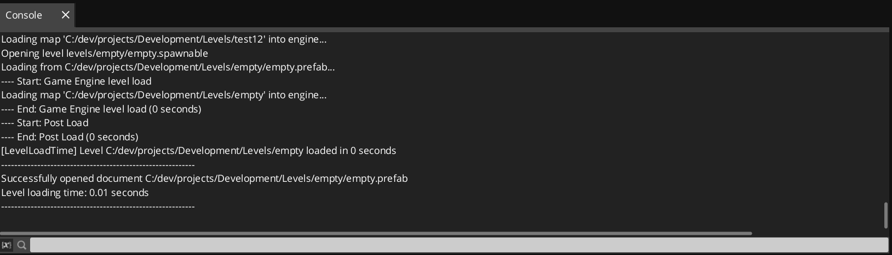
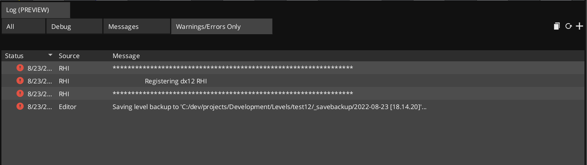

Currently O3DE uses a legacy console that offers no functionality for sorting, filtering, it is simply a text view, users don't get much benefit from it.

Games and simulations may produce significant amounts of logging, a good log viewer improves developer efficiency by allowing to quickly find and identify problems, custom error, warning, or diagnostic messages, etc. Currently developers may copy out of the log, paste the contents into a text editor and search or open the .log file, either option takes the user outside of the O3DE editor which can be a distraction and reduces development velocity.

This proposal is to add a new Tool window and gradually phase out the legacy console log. Using the logging functionality that already exists in AzToolsFramework, which is already used by the Asset Processor and the Material Editor users will get a much better experience without much effort.

## Benefits

- Filtering
- Tab support (multiple filters)
- Tab persistence (save/load the custom tabs/filters users create)
- User defined filters (type and text)
- Improved UX uses editor styles
- Consistency across tools (Asset Processor, Material Editor)
- Code reuse, easier maintenance
- Red-code more legacy code
- Time stamps
- The "System" field in all logging functions is actually used & displayed (i.e. `AzTracePrintf("Editor", "Saving level...");`)

The following image is a proof-of-concept of this proposal:

## Things to consider

- The legacy console has a built-in console command field, this allows cvars and commands to be issued directly. Mitigation: This functionality could be added and/or separated into its own dockable tool

- The new console tool would need to be instantiated earlier than most tools, alternatively, it could parse the existing log when it is created, otherwise early logged messages would not be caught

- The legacy console most may have a smaller impact on performance, the AzToolsFramework console has a built in throttling mechanism to reduce its impact, this needs some investigation. Mitigation: profile the logging system and address performance issues if they exist

- It may still be useful to have a raw "rich text" console, the existing console log could be consolidated into a "raw log" view

## Questions

1. Sorting by "message" might not make sense, but sorting by "status" or "Source" makes a lot of sense. So we should consider turning off sorting for specific columns that don't have specific useful sort types.

_Sorting by message could make sense if you want to see how many time a certain message was logged_

2. When we talk about debugging tab, are we considering the Script Canvas use case as part of that debug workflow? As a user, I'm debugging my script and I don't care about other messages at the moment. I just want to see my print functions.

_This isn't live debugging, it's for developers to add messaging that aids them log things during the development stages, it's usually disabled after a feature is stable, but can be re-enabled if a feature has a bug, it happens frequently during active development_

3. In the header of each tab ("Debug (4)", "Messages (2)", "Warning/Errors (10)") wondering if we should be keeping a number count, so users know a count might be accumulating on another tab you are not looking at.

_Yes, this can be added_

4. The use of icons should probably only be printed in front of an actual error. So when the user is scanning the "Error" tab, they can jump down to the specific error without having to read every line (because above show icons on lines that are not errors but formatting details).

_Yes, this can be added_

5. It would be great if we could at some point learn how to dismiss specific messages that come up often that users know are not effecting their game. Allowing for them to focus on messages that matter to them only.

_Yes, an "Ignore this Message" option can be added_