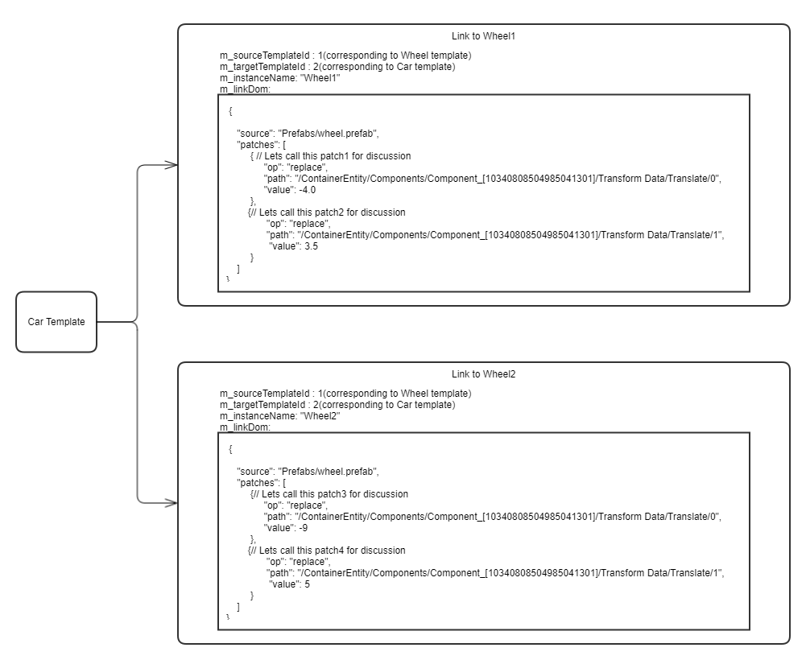

# Summary:
Overrides are one of the most important components of a prefab system. By overriding prefabs, we can make prefabs standout from the rest of their siblings (Imagine a blue car in the middle of 100 red cars). The current prefab system APIs support override creation, including loading them from file and storing them to file. However, authoring of overrides and modifying overrides is not supported in the editor due to dependencies on other ongoing efforts like the [DocumentPropertyEditor](https://github.com/o3de/sig-content/issues/11). This TDD proposes a set of APIs that will make managing prefab overrides easier, which can be called by editor tools like outliner and inspector.

The main idea of this design is to maintain a [DomPrefixTree](https://github.com/o3de/o3de/blob/development/Code/Framework/AzCore/AzCore/DOM/DomPrefixTree.h) that would track the overrides on prefab links. Other systems can query the tree to know which prefabs/entities/components/properties are overridden on a prefab template. There will be one DomPrefixTree per prefab link. The tree can also be used to add/remove overrides and modify existing overrides. In order for this design to work, the underlying in-memory storage structure of patches would need to change. Currently the patches are stored in a rapidjson::Document which doesn't give enough flexibility to work with individual patches in a fail-proof way. This design proposes that the structure to store patches internally be changed to AZ:Dom:PrefixTree<rapidjson:Document>, which will become the source of truth about the state of patches from a template to one of its descendant nested templates.

This work will get us one step closer to delivering an override authoring experience in the editor.

Note : This design uses the terms 'patches' and 'overrides' synonymously. They both mean the same thing in the context of this design.

# What is the relevance of this feature?
## Why is this important?
This is important because overrides visualization, authoring and modification gives scene/level designs so much more control in building large and complex scenes. It also opens doors for easily importing file formats like .fbx and overriding the default procedural prefabs they generate.

## What are the use cases?
- As an editor user, I want to know which prefabs, entities, components and properties are overridden when I load a level so that I can modify those overrides.
- As an editor user, I want to add/remove an override so that I can build large and complex levels.
- As an editor user, I want to modify an overridden property so that I can adjust properties according to my needs

## What will it do once completed?
Once completed, the prefab system can be queried using the interfaces provided below to query, add, remove and modify overrides on prefabs. While this design facilitates these queries, it doesn't cover the below topics in detail:

- How overrides will look visually in the editor. UX requirements will be gathered later after discussion with folks experienced with UX and editor tools.
- Integration of prefab overrides with the DocumentPropertyEditor. The integration details will be covered under a different RFC which will be built on top of this work.

# Feature and Technical design description:
## Glossary

- **DOM** : Document Object Model is a representation of an object data in a tree format where each node represents a certain part of the document.
- **Prefab Template** : The in-memory object that maintains the DOM of a prefab along with additional metadata. There will be one template created for a '.prefab' file loaded into the editor
- **DomPrefixTree** : A prefix tree implementation for AZ:Dom:Path that stores metadata of any provided type. It is defined [here](https://github.com/o3de/o3de/blob/development/Code/Framework/AzCore/AzCore/DOM/DomPrefixTree.h).
- **DocumentPropertyEditor or DPE** : A new property editor that is built using a DOM model instead of actual c++ objects. It's a replacement for the current Reflected Property Editor (RPE) and is currently in development.
- **Focus Mode** : A UI feature where the focus will always be on a single prefab in the entity outliner. There are plans to extend this idea to the viewport too. The idea is that the default edits in the editor go to the focused prefab's template DOM.
- **Link** : An in-memory object that represents a connection between two templates. It contains the Patches to be applied on the source template by the target template, along with additional metadata.
- **Patches/Overrides** : The list of changes that get applied on top of the nested prefab template to distinguish it from other nested prefabs. These changes live on the link object when prefabs are loaded and applied on the DOM of the link's target template.

## Current state of overrides

When a prefab is loaded, it creates [Link objects ](https://github.com/o3de/o3de/blob/development/Code/Framework/AzToolsFramework/AzToolsFramework/Prefab/Link/Link.cpp)that contains metadata about the connection between two templates. Part of this metadata is the link DOM that contains the path to the source prefab and a list of patches to be applied on the nested template. This DOM is currently stored in rapidjson::Document format. This DOM that contains the patches to be applied can be modified during editor operations. The same DOM gets saved to the prefab file if a user choses to save the prefab. The below diagram visualizes 2 link objects between a car template and a wheel template.


The current storage structure and implementation of patches have a few drawbacks, namely:

1. Overrides are stored in an array inside a rapidjson:Document. This makes iterating and managing an individual patch difficult and time consuming. There isn't any quick look up structure in place to know whether an entity in a prefab hierarchy is overridden by its ancestor. This is important in order for editor tools to quickly know what is overridden on a prefab or an entity.
2. Prefabs give direct access to link DOM, which makes it hard to know when overrides get modified/added/removed. 

## Proposed changes to overrides


### Changing the in-memory storage format of overrides
Overrides are currently stored as an array in a rapidjson::Document format, which makes accessing and modifying individual patches harder. Currently, the reference to these patches is made accessible through the Link class but that would mean that overrides can get modified without notifying the prefab system, which makes tracking them hard and maintaining a DomPrefixTree for them even harder. One of the first things that needs to be done is to change existing APIs to only allow const references to the patches. While that solves the problem of managing the lifecycle of overrides, it still makes querying for individual patches hard. So, we need to change the storage structure of patches to be something that will give us access to individual patches in an easier way. To achieve this, patches will be stored in a AZ:Dom:PrefixTree<PatchData>. A DomPrefixTree is a templated class that can store any kind of metadata about the patches to make querying them easier.

### Maintaining the order of patches when querying the tree
Once patches are created in an order and stored on a link, the same order should be maintained for patch application to prevent failures. For example, imagine a scenario where there are 5 patches each inserting an element into an array. If the order of the patches is jumbled and the first patch in the new order has a path like (/someArray/4), it will fail because the array has 0 elements. So, we need to also maintain an index along with a patch in the tree. The index will be used to compare patches and sort them in the right order before copying them into a rapidjson:Document. Each link object will have an atomic counter for the patch indices that will be incremented when a new patch gets inserted into the tree. A new struct called 'PatchData' will be created that will be a wrapper around the patch and the index.
```
struct PatchData
{
    rapidjson::Document m_patch;
    uint32_t m_index;
}
```
So, instead of just the patch, we'll be storing this PatchData object in the prefix tree which makes the type AZ:Dom:PrefixTree<PatchData>. The idea behind 'PatchData' is that its an encompassing struct that can grow in the future to add more metadata about each individual patch. For example,  we may in the future, want to differentiate patches loaded from file vs patches generated by the system because patches loaded from file are user data and we should be careful not to remove them without explicit user permission. To achieve something like that, we can add a new boolean to the struct called 'isLoadedFromFile' to indicate that this patch has been loaded from file. 

### One DomPrefixTree per link
There will be one override prefix tree created per prefab link that will maintain a view of all overrides that the link has on it. The vision of the focus mode feature is that a user will only be modifying the data of a specific template in the editor, whether that's the template of an individual prefab within the level or whether it's the template of the level itself. So, maintaining one big prefix tree for everything in the level will only be a waste of tree nodes and also could have performance bottlenecks as levels grow in size.

Since prefabs can have nested prefabs under them, a path to an entity in a prefab can look like "/Instances/instanceA/Instances/instanceB/....../Entities/entity1/Components/component1/property1" . Each of these path tokens will be a node in the tree. It is possible for overrides to exist on component properties or components or entities or prefab instances. The path to an object can easily be queried by iterating the dom values and the same path can be used against the DomPrefixTree to query whether an override exists for the given path.

**Example**: Going by the same example above where a car prefab has overrides on 2 wheel prefabs, the same overrides would look like this in the DomPrefixTrees when visualized:


### Reconstructing rapidjson:Document from DomPrefixTree
Since templates still use rapidjson:Document as their DOM format, if we want to fetch all patches on the link and apply them on a template during editor operations, we'd need to fetch the patches from the DomPrefixTree and copy them into a rapidjson:Document. This shouldn't be a problem though because the benchmarks for DomPrefixTree only takes a few thousand nanoseconds to visit 1000 entries, which is close to the maximum number of patches we anticipate on an individual link. If this still turns out to be a bottleneck to the system, we can maintain a cached rapidjson:Document that is constructed once from the tree and used for subsequent calls to get a rapidjson:Document. If the tree gets modified due to a user action, the cached document will become stale and needs to be reconstructed again from the tree.

### API
The below class defines an interface that can be queried by internal systems. The class that implements this interface should also update dependent templates when patches get added/removed/modified so that the patches are correctly propagated to the dependent templates.
```
// These are the only 3 types currently supported since we use JsonSerialization::CreatePatch to generate patches
enum class OverrideType
{
    Add, 
    Remove,
    Replace
};

//! This interface must be used only by internal systems like prefabs to access the DomPrefixTree corresponding to the templateId provided and query/update overrides in the tree. 
//! For other systems and user calls in general, the PrefabOverridePublicInterface must be used.
class PrefabOverrideInterface{

    //! Checks whether a valid override is present at the provided path in the tree. By default it checks the current node and all of its children nodes too.
    virtual bool IsOverridePresent(LinkId linkId, AZ:Dom:Path path, AZ::Dom::PrefixTreeTraversalFlags flags = AZ::Dom::PrefixTreeTraversalFlags::ExcludeParentPaths);

    //!  Removes an override if an override is present at the path.
    virtual bool RemoveOverride(LinkId linkId, AZ:Dom:Path path);

     //!  Adds an override at the given path in the tree. If an override already exists, it replaces it.
     virtual bool AddOverride(LinkId linkId, AZ:Dom:Path path, rapidjson:Document override);
	
    //! Updates an override if one exists at the path provided.
    virtual bool UpdateOverride(LinkId linkId, AZ:Dom:Path path, rapidjson:Document override);
	
    //! Gets the type of override if one exists at the 
    virtual OverrideType GetOverrideType(LinkId linkId, AZ:Dom:Path path);
}
```

While the above interface can be used by the prefab system to query for overrides, we also need a public facing interface that can be queried by editor tools like outliner and inspector, which typically only deal with entity ids and doesn't need to know what a 'LinkId' is. Here is the public interface for that:

```
class PrefabOverridePublicInterface
{
    //! Checks whether an override exists on the entity or any of its components from the focused prefab. 
    virtual bool isEntityOverriddenByFocusedPrefab(AZ::EntityId entityId) = 0;

    //! Checks whether an entity is added as an override -- useful for outliner to visualize add-entity overrides in a different way.
    virtual bool isEntityAddedAsAnOverrideByFocusedPrefab(AZ::EntityId entityId) = 0;

    //! Checks whether an entity is added as an override -- useful for outliner to visualize add-entity overrides in a different way.
    virtual bool IsPrefabAddedAsAnOverrideByFocusedPrefab(AZ::EntityId prefabContainerEntityId) = 0;

    //! The path gets generated by a prefab adapter to the DPEs in entity inspector.
    virtual bool UpdateComponentOverrideFromFocusedPrefab(AZ::Dom::Path path, rapidjson::Document value) = 0;

    //! Other methods like AddComponentAsOverride, AddPropertyUpdateAsOverride, RemovePropertyUpdateOnOverride follow similar pattern as the above function.
}
```

The below class is more entity-friendly handler that implements the above interface, which the outliner and inspector will call. It's written in pseudo code to give an idea of how the API will look like eventually. The default tree to query for overrides would be the tree corresponding to the link between the focused prefab template and the template of the topmost instance in the hierarchy. For example, in a scenario where there are 3 prefabs: city, block and house and if the hierarchy is city→block→house and the focus is on the city prefab, the link to query would be the one between city and block templates. 

```
class EntityOverrideHandler
    : public PrefabOverridePublicInterface
{
    //! Checks whether an override exists on the entity or any of its components from the focused prefab. 
    bool isEntityOverriddenByFocusedPrefab(AZ::EntityId entityId)
    {
        TemplateId focusedTemplateId = AZ::Interface<PrefabFocusInterface>::Get()->GetFocusedPrefabTemplateId(s_editorEntityContextId);
        AZ::Dom::Path pathToEntityFromFocusedTemplate = // Use PrefabDomUtils to fetch path to entity here
        // Fetch linkId from the topmost instance of the focused prefab. It's a member variable inside Prefab::Instance class.
        AZ::Interface<PrefabOverrideInterface>::Get()->IsOverridePresent(linkId, pathToEntityFromFocusedTemplate, AZ::Dom::PrefixTreeTraversalFlags::ExcludeParentPaths);
    }

    //! Checks whether an entity is added as an override -- useful for outliner to visualize add-entity overrides in a different way.
    bool isEntityAddedAsAnOverrideByFocusedPrefab(AZ::EntityId entityId)
    {
         TemplateId focusedTemplateId = AZ::Interface<PrefabFocusInterface>::Get()->GetFocusedPrefabTemplateId(s_editorEntityContextId);
        // Fetch linkId from the topmost instance of the focused prefab. It's a member variable inside Prefab::Instance class.
        AZ::Dom::Path  pathToEntityFromFocusedTemplate = // Use PrefabDomUtils to fetch path to entity here --- could be a container entity too.
         if (isEntityOverridden(entityId)
        {
            OverrideType overrideType = AZ::Interface<PrefabOverrideInterface>::Get()->GetOverrideType(linkId, pathToEntityFromFocusedTemplate);
            return (overrideType == OverrideType::Add);
        }
        return false;
    }

    //! Checks whether an entity is added as an override -- useful for outliner to visualize add-entity overrides in a different way.
    bool IsPrefabAddedAsAnOverrideByFocusedPrefab(AZ::EntityId prefabContainerEntityId)
    {
        if (prefabContainerEntityId.IsContainerEntityId)
        {
             return isEntityAddedAsAnOverride(prefabContainerEntityId);
        }
        return false;
    }

    //! The path gets generated by a prefab adapter to the DPEs in entity inspector.
    bool UpdateComponentOverrideFromFocusedPrefab(AZ::Dom::Path path, rapidjson::Document value)
    {
         TemplateId focusedTemplateId = AZ::Interface<PrefabFocusInterface>::Get()->GetFocusedPrefabTemplateId(s_editorEntityContextId);
        // Fetch linkId from the topmost instance of the focused prefab. It's a member variable inside Prefab::Instance class.
        AZ::Interface<PrefabOverrideInterface>::Get()->UpdateOverride(linkId, pathToEntityFromFocusedTemplate, value);
    }
}
```

The below interface can be implemented to fetch all the overrides applied by a prefab on its nested prefabs. This will be helpful when you need a wholistic view of everything a particular prefab overrides.
```
//! This interface is used to list/remove all overrides a prefab has on its nested prefabs.
class ListPrefabOverridesInterface
{
    using PrefabOverridesList =  AZStd::unorderedmap<AZStd::string,  AZStd::vector<const rapidjson::Document&>>;

    // Return the overrides applied on each nested prefab. The string of the nested prefab key is used in the map so that overrides are bucketed per nested prefab.
    virtual PrefabOverridesList ListPrefabOverrides(AZ::EntityId prefabContainerEntityId);

    // Removes all overrides applied by a prefab on its nested prefabs. Transform component overrides are an exception because if they are removed, everything prefab instance will move to a single location in the world.
    virtual bool RemoveAllOverrides(AZ::EntityId prefabContainerEntityId);
}
```

# What are the advantages of the feature?
Already covered in the above relevance section. It addresses the above mentioned user stories this way:

> As an editor user, I want to know which prefabs, entities, components and properties are overridden when I load a level so that I can modify those overrides.

Build a path to the required prefabs/entities/components/properties and query the prefix tree corresponding to the appropriate link to see whether overrides exist at that path or not

> As an editor user, I want to add/remove an override so that I can build large and complex levels.

With the help of override mode (currently being prototyped), construct a path to the entity/property that needs overriding and add it to the appropriate prefix tree.

> As an editor user, I want to modify an overridden property so that I can adjust properties according to my needs.

Query the override from the corresponding prefix tree just like previous cases and update the value of stored in the PatchData object in the tree.

# What are the disadvantages of the feature?
There shouldn't be any disadvantages to this feature. However there are a few risks:

- Use of new APIs: This design relies on using AZ::Dom:Path and AZ::Dom::DomPrefixTree APIs, which are relatively new to the engine. Prefabs will be one of the first systems to use these APIs. If we need some features to be added or modified for these APIs, we should find the best ways to do that while adhering to the tenets of the APIs. 

- Dependency on DPE : While it's not an immediate dependency, prefabs do require the entity inspector to use DPE instead of RPE for the end goal of property override visualization.

# How will this be implemented or integrated into the O3DE environment?
## Execution Plan (And Dependencies)

- Refactor m_linkDom in Link.h to be a Az:Dom:PrefixTree storing PatchData
  - Verify that loading of levels and prefabs with nested prefabs still work as expected and load overrides correctly.
  - Verify that storing of levels and prefabs with nested prefabs correctly store the overrides
  - Verify that editor operations that affect the patches on the link still work and aren't slowed down due to needing to convert to a different format
- Create DomPrefixTree api for Prefab overrides
  - Add Override
  - Remove Override
  - Replace/Update Override
- Integrate DomPrefixTree api with Prefab templates
  - When template is loaded, construct the tree from the list of patches
  - When patches on a link get modified, update the tree accordingly

## Testing plan

- Unit tests to validate that the DomPrefixTree gets correctly updated on patch operations
  - Creating an override
  - Modifying an override
  - Removing an override
- Automated tests to verify that levels and prefabs correctly generate the DomPrefixTree when loaded from disk
  - Loading a level with overrides
  - Instantiating a prefab with overrides
- Benchmarks to verify that modifying large DomPrefixTree is performant.
  - Modifying a DomPrefixTree scales horizontally
    - example: A prefab has 10000 child prefabs and there's an override on each one of them
  - Modifying a DomPrefixTree scales veritcally
    - example: A prefab has 10000 levels of nesting (prefab within prefab within prefab and so on ......) and there's an override on the leaf prefab created by the root prefab
  - Combination of the above 2 cases, which is the more common scenario
  
There are 7 types of overrides you can have on a prefab. Tests should written such a way that these 7 types of overrides are captured in them:

1. Modify a component property
2. Add a component
3. Remove a component
4. Add an entity
5. Remove an entity
6. Add a nested prefab
7. Remove a nested prefab

**Note**: Prefabs can have any depth of nesting going on. The tests should make sure that overrides from any ancestor are accounted for, not just overrides from immediate parent.

## Post-Launch
- Prototype override visualization and have UX discussions
  - Query DomPrefixTree for entities in the outliner. If a valid node exists in the tree, mark the entity outliner row overridden in some way (example: change background color)
  - Go one step further to know which type of override it is, (example: add-entity and add-prefab overrides can be marked visually different than edit-entity override)
  - Inspector visualization can also be prototyped for add-component overrides
  - Discuss with UX on what other ways the tree can be used to provide meaningful UX visualization.
- Integrate with entity inspector - RFC needed
  - Accept patches from DPEs of inspector and massage them into rapidjson:Document patch
  - During loading of DPEs in the inspector, convert query the DomPrefixTree to fetch patches and convey that information to the DPE

## Migration Plans (Data, and workflows)
There will not be a need for data migration for this work. Code refactoring needs to be done since the format in which patches are stored in memory changes. 

### Are there any alternatives to this feature?
## Keep using existing override storage structures to query/manage overrides instead of using a prefix tree
**Idea**: The data about what's overridden is already present in the system. Instead of creating a new data structure, use these existing structures to query and manage overrides.

**Pros**:
- Avoids changes to data format of patches and avoids creating a new API

**Cons**:
- A link can have many patches. To find a single path match, we'd have to crawl through all the patches, which is expensive. We'd also have to do a lot of string comparisons for each path, particularly when the level of nesting increases. This process can take up a lot of time when there are many overrides or many levels of nesting and doesn't scale. Same problems arise for manipulating an override as well since we first need to know where to look for the override.

## Use a custom prefix tree solution rather than using AZ::Dom::DomPrefixTree
**Idea**: Rather than using DomPrefixTree API, write a custom prefix tree api that serves the purpose of managing overrides on prefabs.

**Pros**:
- Gives better flexibilty over the API in terms of what can be changed and also can tailor it better according to the needs of the prefab system

**Cons**:
- A lot of functions between the two APIs will be similar and will lead to a mirror API that looks almost identical and result in duplicated functionality
- Prefab operations can be made faster by using AZ:Dom:Path for path comparisons and lookups, which performs better than your average string comparisons because it uses AZ::Name under the hood

## Use an index based look up of patches for the prefix tree rather than store patch values in them
**Idea**: Instead of storing actual patches in a prefix tree, keep existing patches as is and create a tracking prefix tree that can just store indices to the individual patches in the link DOM

**Pros**:
- Do not need to change the format of patches stored in the Link. We can even just keep using rapidjson:Document format and store indices to individual patches

**Cons**:
- When an override gets deleted, the indices of the other overrides below it in the array will change and therefore the tree needs to be adjusted with those updated again.
- Must always do a reconstruction of the tree nodes if the link dom gets changed since we cannot maintain the lifecycle of individual nodes.

## Keep using rapidjson::Document to store patches and use pointers to individual patches for DomPrefixTree
**Idea**: Individual overrides are stored as an array of rapidjson::Value objects within a rapidjson:Document. So, we can use pointers to these objects as the metadata in the prefix tree and use them to look up overrides

**Pros**:
- Do not need to change the format of patches stored in the link. Leads to quickly implementing the prefix tree solution.

**Cons**:
- When an override gets deleted, making a pointer value null will not remove it from the actual DOM. So we'd need to do some indexing lookup again to keep the underlying DOM in a correct state and we run into the same problems as the previous alternative solution.
- Must always do a reconstruction of the tree nodes if the link dom gets changed since we cannot maintain the lifecycle of individual nodes.

## How will users learn this feature?

- An impactful change email will be communicated to discord and sig-content email lists when we enable override authoring and visualization.
- The prefab workflows guide will be updated to add new workflows around override authoring and modification.
- On demand video tutorials will be created if the workflows are identified to have a steep learning curve for new and existing users.

## Are there any open questions?
**Do Patches and Overrides mean the same thing?**
In the context of this design, yes. They are saved on prefab files with the name 'Patches' but in some contexts, referring to them as 'overrides' makes more sense. So the two terms are used in an interchangeable fashion in this document.

**Does this design also cover application of overrides and propagating them to other instances of the prefab template?**
The support for application of overrides and propagating them already exists in the existing prefab system. This design focuses on providing fast and convenient APIs to make override management much easier.

**Why not use AZ:Dom:Value to store prefab template DOM data?**
Using AZ:Dom:Value will in fact result in faster DOM operations. However, moving from rapidjson:Document to AZ:Dom:Value will be a big undertaking and is out of scope of this design.

**Why not use AZ:Dom:Patch to store patches?**
Related to the above question. Since template DOM still uses rapidjson:Document, if we store patches in AZ:Dom:Patch format, we'd have to constantly switch between the 2 formats, which will add a lot of overhead to the system.

**Will the usage of these APIs need to wait till the DocumentPropertyEditor work is finished for the Inspector?**
No. These APIs can be used to achieve override visualization in entity outliner and any other custom tools in the editor. Once the DPE work finishes for inspector, the prefab adapter talking to the DPE will also query these same APIs. But until then, these APIs can be used without needing to wait for the DPE to finish.

**Will there be any changes to the way prefabs are serialized or deserialized? Will version conversions need to be provided between old and new serialized data?**
There won't be any changes to the serialized data of prefabs. Patches will continue to be loaded and saved in the same format. We are only changing underlying data format of patches when they are loaded into memory.

**Has any of the work mentioned in this design been prototyped?**
Yes. Almost all changes proposed in the design have been prototyped to some extent. Using the prototype, it was verified that we can achieve override visualization in the entity outliner with the above design. The prototyped changes [can be viewed here](https://github.com/aws-lumberyard-dev/o3de/compare/srikappa/Overrides/daiminiPrototype...aws-lumberyard-dev:o3de:srikappa/Overrides/DomPrefixTreePerLink).
