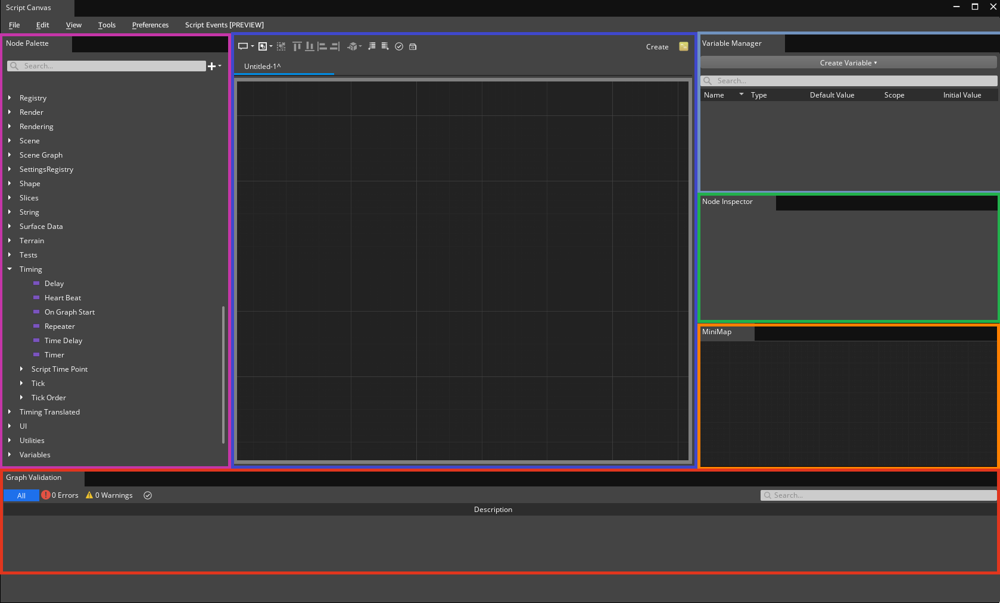
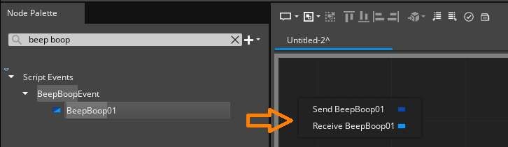
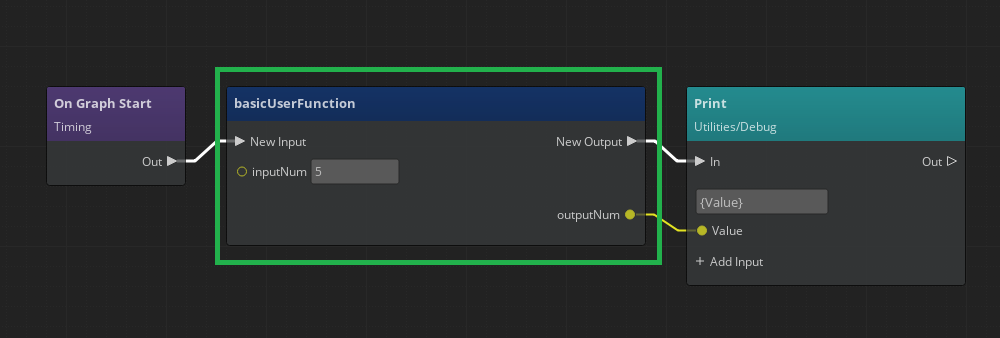

# Script Canvas Workflow Tests

Testing in this area should focus on the functionality of Script Canvas editor.

## Common Issues to Watch For

Test guidance will sometimes note specific issues to watch for. The common issues below should be watched for through all testing, even if unrelated to the current workflow being tested.
1. Asset processor errors when loading/saving graph files
2. Warnings or assets that appear in the graph validation log
3. Unresponsive UI elements 

### Platforms:
- Windows
- Linux

### Documents and Common Terms
[O3DE Documentation: Script Canvas](https://www.o3de.org/docs/user-guide/scripting/script-canvas/)  
[O3DE Documentation: Script Canvas Editor Interface Guide](https://www.o3de.org/docs/user-guide/scripting/script-canvas/get-started/editor-interface/ntnt)  
[O3DE Documentation: User Functions](https://www.o3de.org/docs/user-guide/scripting/script-canvas/editor-reference/functions/)  

<b>Script Canvas (SC) Editor</b>: Editing tool separate from O3DE's Editor used to create and modify script canvas graph files

<b>SC Graph</b>: A collection of node objects that can be modified and saved to a file.

<b>SC Editor Basic Tools</b>: The 5 default tools opened and anchored to the main SC editor window; Node Palette, Variable Manager, Node Inspector, Minimap, Graph Validation

<b>SC Component</b>: A component that can be searched and attached to an entity in O3DE editor.

<b>User Function</b>: A type of SC graph that has 2 special nodes: Entrance & Exit nodelings. User Functions are intended to give users a way to generate re-usable graph logic similar to a function in a standard programming language. When a valid User Function graph is created and saved it will appear in the Node Inspector under the 'User Functions' category.

<b></b>
## Area: Opening and configuring the Script Canvas Editor

### Project Requirements
Any project can be used and no special gems are required.

**Product:** 
Visible and responsive Script Canvas editor.

**Suggested Time Box:** 
15 minutes

| Workflow                                                            | Requests                                                                                                                                                                                                                                                                                                                                                                                                                                                                      | Things to Watch For                                                                                                                                                                                                                               |
|---------------------------------------------------------------------|-------------------------------------------------------------------------------------------------------------------------------------------------------------------------------------------------------------------------------------------------------------------------------------------------------------------------------------------------------------------------------------------------------------------------------------------------------------------------------|---------------------------------------------------------------------------------------------------------------------------------------------------------------------------------------------------------------------------------------------------|
| Launch and configure script canvas editor                           | *   Check different methods of entry to SC editor (tools menu, SC component, keyboard shortcut) *   Verify default SC editor panes render and resize. panes can undock, dock back onto SC editor.  * Verify no rendering issues when panes are altered.                                                                                                                                                                                                                 | *   Script Canvas editor launch method does not work or does not launch quickly.   * Script Canvas Editor not retaining configuration settings on close/relaunch                                                                               |
| Verify main Script Canvas window pane renders a script canvas graph | *   The main script canvas editor window should render a script canvas graph when a new or existing file is opened *   creating or opening multiple files should generate multiple tabs in the main window  * Creating or opening several files should not impact script canvas editor's performance  * Modifying an existing file places am asterix in the graph's tab  * A drop down menu for file selection appears when enough script canvas files are opened | *   An asterix appears on the tab only if a change is made to the file * You are always prompted to save a modified file when closing the tab                                                                                                  |
| Verify default SC editor tools                                      | *   Verify SC editor launches with the 5 default tools *   Verify UI elements in each of the tools respond when clicked or dragged                                                                                                                                                                                                                                                                                                                                         | *   Script Canvas tools do not render properly *   Tools become unresponsive after configuring them                                                                                                                                            |
| Use basic Script Canvas graph controls                              | *   Open or create a new script canvas graph file and make sure the basic script canvas graph controls function when clicked or keyboard shortcut is used. *   Check if a helpful tooltip is generated and rendered properly for each control.  * Tooltip does not go away prematurely  * Pan/Zoom on the script canvas graph and make sure graph renders properly                                                                                                   | *   Control does not respond or responds too slowly when used  *   Controls gray out under appropriate circumstances *   Cannot interact with grayed out controls                                                                           |

## Area: Default Script Canvas Editor tools

### Project Requirements
SC editor opened with the 5 basic tools enabled.

**Product:** 
Responsive Script Canvas editor with all 5 basic tools enabled. No Asset Processor warnings about invalid data or files.

**Suggested Time Box:** 
30 minutes

| Workflow                                                            | Requests                                                                                                                                                                                                                                                                                                                                                                                              | Things to Watch For                                                                                                                                                                                                                               |
|---------------------------------------------------------------------|-------------------------------------------------------------------------------------------------------------------------------------------------------------------------------------------------------------------------------------------------------------------------------------------------------------------------------------------------------------------------------------------------------|---------------------------------------------------------------------------------------------------------------------------------------------------------------------------------------------------------------------------------------------------|
| Use and observe minimap behavior                                    | *   Open or create a graph with multiple nodes *   Dragging the minimap will pan the main script canvas graph view  * Switching between multiple files will update the minimap                                                                                                                                                                                                                  | *   The minimap does not render or update properly *   Panning around the minimap does not cause the effect in in main editor window and vice-versa                                                                                            |
| Create a variable node with Variable Manager                        | *   Use Variable Manager to create a variable of any type.  *  Modify the properties of the variable.  * Drop the variable off the variable manager list onto a graph.  * Drag the variable off the variable manager list onto a node's input/ouput field (same type).   * Convert a node's input/ouput field to a reference and drag/select variables from the variable manager onto it. | *   Variable properties do not update when modified.  * Variable manager list refreshes and updates properly when variables are created, deleted or modified.  * Node Inspector updates when variables are selected in the Variable Manager |
| View and Modify a node with Node Inspector                          | *   Click a node on the graph and verify its fields and values are displayed in the Node Inspector.  * Verify that the values can be modified through Node Inspector.  Verify Node Inspector updates when different nodes or variables are selected.   * Select multiple nodes at once and see how they are reflected in Node Inspector.                                                     | *   Fields are properly labeled in Node Inspector.   * Changes made through Node Inspector are reflected on the node and vice-versa.                                                                                                           |
| Create a graph validation error and warning                         | *   Drag several nodes onto a fresh SC graph. Run validation on the graph to verify warnings are generated and nodes are highlighted.   * Connect nodes and run validation to verify that warnings are no longer generated.  *                                                                                                                                                                  | * Highlighting & Dimming of failing nodes not updated.  * Warnings and errors not removed when issue is resolved.  * Conditions that produce an invalid graph do not trigger a warning or error.                                            |
| Use the Node Palette to find node types                             | *   Search the Node Palette for a specific node type.  * Use the scrolling view controls to browse nodes.  * Drag a node off the palette onto a new SC graph.  * Use right click context menu on a SC graph to search & browse for nodes.   *   Mouse over a node in the palette to display a tooltip                                                                                     | *   Node palette renders properly when entering/deleting text in search field.  * Node categories can be expanded and collapsed.                                                                                                               |

## Area: Basic Script Canvas graph tests 
Testing in this area verify basic functionality of script canvas graphs and more in-depth functionality of the default editor tools.

### Project Requirements
Any project with a new level. SC editor with the 5 basic tools enabled

### References
Default Script Canvas editor layout with the default tools enabled and highlighted

**Product:** 
Script canvas graph files with basic input and output when run through game mode or interpreter

**Suggested Time Box:**
60 minutes

| Workflow                                                                                                        | Requests                                                                                                                                                                                                                                                                                                                                                                                                                                                                                                                                                                                                                                                                                                                                                                                                                                                                                                                                                                                                | Things to Watch For                                                                                                                                                                                             |
|-----------------------------------------------------------------------------------------------------------------|---------------------------------------------------------------------------------------------------------------------------------------------------------------------------------------------------------------------------------------------------------------------------------------------------------------------------------------------------------------------------------------------------------------------------------------------------------------------------------------------------------------------------------------------------------------------------------------------------------------------------------------------------------------------------------------------------------------------------------------------------------------------------------------------------------------------------------------------------------------------------------------------------------------------------------------------------------------------------------------------------------|-----------------------------------------------------------------------------------------------------------------------------------------------------------------------------------------------------------------|
| Create and save a new script canvas graph with basic input and output                                           | *   Use any method to create a blank script canvas file.     *   Use the node palette or right click context menu to add and connect multiple nodes.     *   Create a logic sequence that will occur on graph start or on the activation of an entity     *   Use the variable manager to create one or more new variables. Change a field on a node to a reference and use the newly created variable  * Click on a variable you created and use the Node Inspector to modify it. Change the name, default value and scope.  * Save the graph file and verify it functions as expected by attaching it to an entity and running the game or loading the graph in the Interpreter                                                                                                                                                                                                                                                                                                        | *   Saving the file causes asset processor errors or warnings *   Repeatedly running the game causes the graph to produce no results or inconsistent results *   Console warnings or errors regarding Lua |
| Create a 2nd script canvas graph file and use a script event to make the two files communicate during gameplay  | *   Use the O3DE asset editor to create a new script event.  *   Add a new event to the script event asset. Give it a unique and recognizable name  * Add input parameters to the event and save the asset. Verify the file appears on disk  * Search the Script Canvas editor's node inspector for the new event asset. Verify that you can add a send/receive signal to a graph.     * Configure two or more script canvas files to send and receive signals from each other. Verify the communication with debug output or with more complex logic and game behavior   <b> Examples: </b>  * Attach a send signal to a timer node so every other second the receiving script changes a light's color.  * Send multiple different script events and a script canvas file that has different logic predecated on receiving each of the different signals | *   Tool display issues/unusable portions of tool *   Interactivity issues                                                                                                                                   |

## Area: Advanced Script Canvas graph Tests
Tests in this verify more advanced core features of script canvas.

### Project Requirements
Any project with a new level. SC editor with the 5 basic tools enabled

### References
Main Script Canvas editor view with advanced control buttons highlighted 
 

**Product:**
Organized and annotated Script canvas graph files that produce verifiable outputs when attached to entities and run through game mode or interpreter

**Suggested Time Box:**
120 minutes

| Workflow                                                                                                                                                                                                | Requests                                                                                                                                                                                                                                                                                                                                                                                                                                                                                                                                                | Things to Watch For                                                                                                                                                                                                                                         |
|---------------------------------------------------------------------------------------------------------------------------------------------------------------------------------------------------------|---------------------------------------------------------------------------------------------------------------------------------------------------------------------------------------------------------------------------------------------------------------------------------------------------------------------------------------------------------------------------------------------------------------------------------------------------------------------------------------------------------------------------------------------------------|-------------------------------------------------------------------------------------------------------------------------------------------------------------------------------------------------------------------------------------------------------------|
| Create a user function and verify its input/output when called from another graph   | * Use Script Canvas editor to create a graph file with enter/exit nodelings  * Place complex logic or entity behavior between the enter/exit nodelings.   * Give the graph file a unique recognizable name and save it  * Call the user function from another graph by finding it in the node palette or right click context menu     <b>Example Functions: </b>   Two color parameters and returns a blended color  Entity parameter and returns the number of child entities   No parameters or output but triggers behavior. | * Recursive functions are <b>NOT</b> supported at the moment  * Modifications to the user function file should require scripts calling the function to also be modified. |
| Generate and modify translation data                                                                                                                                                                    | * Generate translation data for nodes.  * Modify the translation data and verify that the modifications are reflected in Script Canvas editor.                                                                                                                                                                                                                                                                                                                                                                                                    | * Generating translation data does not cause performance dips.  *Non-english characters render properly in SC graph.   *                                                                                                                              |
| Use groupings and annotations to organize a graph.                                                                                                                                                      | * Place groupings on a graph.  * Add and remove nodes to the groupings.   * Place annotations on the graph.   * Change the size and positions of groupings and annotations.   * Use Node Inspector to modify the test and format of groupings and annotations.                                                                                                                                                                                                                                                                              | * Groupings and annotations not rendering when placed on the graph.   * Nodes not "Sticking" to a grouping when size or position is changed.   * Modifications to groups and annotations not maintained when graph is saved/loaded.                   |
