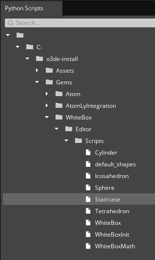

# Python Scripts Workflow Tests

Testing in this area should focus on the functionality of executing python scripts.

## Common Issues to Watch For

Test guidance will sometimes note specific issues to watch for. The common issues below should be watched for through all testing, even if unrelated to the current workflow being tested.
1. Asset processor errors when importing/executing python scripts
2. Warnings or errors that appear in the Editor console
3. Unresponsive UI elements 

### Platforms:

- Windows
- Linux

### Documents and Common Terms

[O3DE Documentation: Editor Python Bindings Gem](https://www.o3de.org/docs/user-guide/gems/reference/script/python/editor-python-bindings/)

**Python Scripts**: Tool that lists python script samples and allows to execute those scripts.

## Area: Opening Python Scripts tool and executing sample scripts

### Project Requirements

<ul>
<li>Any project can be used, the Editor Python Bindings gem and its gem dependencies are required.</li>

<li>White box Gem is required to visualize easily the script execution as it includes a python scripts that create various entities with meshes.</li>
</ul>

**Product:** 
Visible and responsive Python Script tool.

**Suggested Time Box:** 
15 minutes

| Workflow                                                            | Requests                                                                                                                                                                                                                                                                                                                                                                                                                                                                      | Things to Watch For                                                                                                                                                                                                                               |
|---------------------------------------------------------------------|-------------------------------------------------------------------------------------------------------------------------------------------------------------------------------------------------------------------------------------------------------------------------------------------------------------------------------------------------------------------------------------------------------------------------------------------------------------------------------|---------------------------------------------------------------------------------------------------------------------------------------------------------------------------------------------------------------------------------------------------|
|Executing python script samples| <ul><li>Open Python Scripts tool via Tools -> Other -> Python Scripts</li><li>Select a script to execute (e. g. Sphere, Staircase)</li><li>Execute selected script using dedicated Execution button.</li></ul>|<ul> <li> Script executes without errors/warnings in the console.</li><li>Entity with mesh component is created and visible in Viewport.</li></ul>
